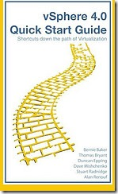

The vSphere Quick Start guide is released and available from [Amazon](http://www.amazon.com/vSphere-Quick-Start-Guide-Virtualization/dp/1439263450/ref=sr_1_4?ie=UTF8&s=books&qid=1258946686&sr=8-4). This guide is written by 6 virtualization guru’s named:

\- [Duncan Epping](http://www.yellow-bricks.com/)

\- [Alan Renouf](http://www.virtu-al.net/)

\- [Dave Mishchenko](http://www.vm-help.com/)

\- [Bernie Baker](http://twitter.com/berniebaker)

\- [Thomas Bryant](http://twitter.com/kix1979)

\- [Stewart Radnidge](http://vinternals.com/)

The book summary from Amazon:

> vSphere 4.0 Quick Start Guide continues from an idea started several years ago by a few engineers. The idea was simple, provide an easy to use reference guide for all level administrators, consultants and architects. Recently VMware introduced many new features in vSphere 4.0 and with this handy pocket guide you will learn about each of these new features. With each chapter, the pages in this essential guide will answer common questions while giving you unprecedented insight into: Expert tips & tricks Pitfalls to avoid RemoteCLI & PowerCLI (PowerShell) scripts Configuration how to’s Virtualization best practices.

> **Paperback:** 256 pages  
> **Publisher:** BookSurge Publishing (November 20, 2009)  
> **Language:** English  
> **ISBN-10:** 1439263450  
> **ISBN-13:** 978-143926345

Here’s some table of contents from the guide:

Can my vCenter server be a Virtual Machine?..................... 18

Create a DRS or HA cluster............................................................... 29

How do I configure sysprep?.......................................................... 32

Recovering the vCenter server...................................................... 38

Configuring Consolidated Backup (VCB)................................. 52

Changing a host’s IP address............................................................ 63

Backing up an ESX host/configuration...................................... 70

Backing up an ESX host/configuration...................................... 70

Removing VMFS-2 drivers............................................................... 82

Manually Upgrade VMware Tools for Linux with the RPM Installer                 102

Migrate a Physical Server to a VM............................................. 130

vSphere Networking Fundamentals....................................... 143

Modify vSwitch properties via the command line......... 147

Modify a DV Port Group via the vSphere Client............... 152

How big should my VMFS volumes be?................................ 168

TCP Offload Engine (TOE) Cards................................................. 179

Adjusting the HBA Queue depth................................................. 180

EMC PowerPath Virtual Edition (PP/VE)............................. 187

Migrating VMs with Storage VMotion.................................... 204

Resetting the root password....................................................... 211

PowerCLI........................................................................................................ 223

PowerCLI Basics.................................................................................. 225

PowerCLI Mastery.............................................................................. 228

Appendix B—Essential Utilities....................................................... 237 If you want to know what’s the best way to design and deploy a VMware ESX environment (VMware ESX, vCenter, P2V, networking, storage and automation using PowerCLI) this is a must read! 

\[ad#verticaal\]
