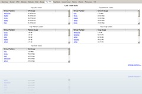
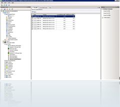
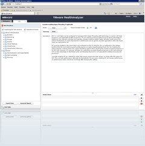
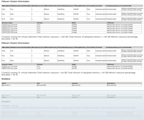

I get a lot of questions about the tools and scripts i use as consultant to check VMware environments. I made a list with tools and scripts i use on a regular basis:

<table border="0" cellspacing="0" cellpadding="2" width="403"><tbody><tr><td valign="top" width="138"><strong>tools</strong></td><td valign="top" width="263"><strong>description</strong></td></tr><tr><td valign="top" width="143">VMware HealthAnalyzer</td><td valign="top" width="268">Appliance or ThinApp package to check the VMware environment.  This tool is available from the VMware partner central</td></tr><tr><td valign="top" width="148"><a href="http://www.robware.net/" target="_blank">RVtools</a></td><td valign="top" width="273">Displays and export information such as cpu, memory, disks, nics, cd-rom, floppy drives, snapshots, VMware tools, ESX hosts, datastores and health checks. about your VMware environment</td></tr><tr><td valign="top" width="153"><a href="http://www.veeam.com/esxi-monitoring-free.html" target="_blank">Veeam Monitor Free Edition</a></td><td valign="top" width="278">Great tool to get quickly the top loaded VMs and hosts</td></tr><tr><td valign="top" width="153"><a href="http://www.vmware.com/support/developer/windowstoolkit/" target="_blank">VMware PowerCLI</a></td><td valign="top" width="278">VMware Powershell Cmdlets to administering vSphere components</td></tr><tr><td valign="top" width="158"><a href="http://www.chiark.greenend.org.uk/~sgtatham/putty/download.html" target="_blank">Putty</a></td><td valign="top" width="283">SSH client</td></tr><tr><td valign="top" width="163"><a href="http://winscp.net/" target="_blank">WinSCP</a></td><td valign="top" width="288">SFTP, FTP and SCP client</td></tr><tr><td valign="top" width="168"><a href="http://www.veeam.com/vmware-esxi-fastscp.html" target="_blank">Veeam FastSCP</a></td><td valign="top" width="293">Fast SCP client that integrates with Veeam Backup</td></tr><tr><td valign="top" width="168">Virtualization EcoShell(VESI)&nbsp;</td><td valign="top" width="293">Management interface for creating ,debugging and executing Powershell scripts.&nbsp;</td></tr><tr><td valign="top" width="173"><strong>scripts</strong></td><td valign="top" width="298"></td></tr><tr><td valign="top" width="178"><a href="http://communities.vmware.com/docs/DOC-9842" target="_blank">VMware vSphere Health Check Report</a></td><td valign="top" width="303">Perl Healthcheck script written by William Lam&nbsp;&nbsp;&nbsp;</td></tr><tr><td valign="top" width="183"><a href="http://www.virtu-al.net/page/2/" target="_blank">PowerPack V3</a></td><td valign="top" width="308">Powerpack for VESI written by Alain Renouf.</td></tr><tr><td valign="top" width="188">Custom Powershell scripts</td><td valign="top" width="313">Scripts such as my own improved Healthcheck script</td></tr></tbody></table>

Here are some screenshots

<table border="0" cellspacing="0" cellpadding="2" width="400"><tbody><tr><td valign="top" width="200">   Veeam Monitor Free Edition&nbsp;</td><td valign="top" width="200"> VESI with PowerPack V3</td></tr><tr><td valign="top" width="200"> VMware Healthcheck ThinApp package</td><td valign="top" width="200">    Custom PowerCLI scripts</td></tr></tbody></table>

If you have suggestions for tools or scripts let me know!

\[ad#verticaal\]
