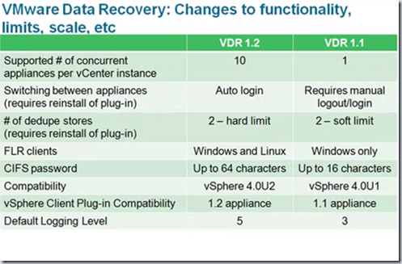

 VMware released the following new product updates:

· VMware ESX(i) 4.0 Update 2

· VMware vCenter Server 4.0 Update 2

· VMware vCenter Update Manager 4.0 Update 2

· VMware Data Recovery 1.2

Always test these updates before deploying in production and make sure that other products (for example VMware View and VMware SRM) are supported with the new updates! Here are the highlights per product update:

## **VMware ESX(i) 4.0 Update 2

**

**ESX 4.0 Update 2 | 10 Jun 2010 | Build 261974  
VMware Tools | 10 Jun 2010 | Build 261974**

What's New

The following information provides highlights of some of the enhancements available in this release of VMware ESX:

- Enablement of Fault Tolerance Functionality for Intel Xeon 56xx Series processors— vSphere 4.0 Update 1 supports the Intel Xeon 56xx Series processors without Fault Tolerance. vSphere 4.0 Update 2 enables Fault Tolerance functionality for the Intel Xeon 56xx Series processors.
    
- Enablement of Fault Tolerance Functionality for Intel i3/i5 Clarkdale Series and Intel Xeon 34xx Clarkdale Series processors— vSphere 4.0 Update 1 supports the Intel i3/i5 Clarkdale Series and Intel Xeon 34xx Clarkdale Series processors without Fault Tolerance. vSphere 4.0 Update 2 enables Fault Tolerance functionality for the Intel i3/i5 Clarkdale Series and Intel Xeon 34xx Clarkdale Series processors.
    
- Enablement of IOMMU Functionality for AMD Opteron 61xx and 41xx Series processors— vSphere 4.0 Update 1 supports the AMD Opteron 61xx and 41xx Series processors without input/output memory management unit (IOMMU). vSphere 4.0 Update 2 enables IOMMU functionality for the AMD Opteron 61xx and 41xx Series processors.
    
- **Enhancement of the esxtop/resxtop utility— vSphere 4.0 Update 2 includes an enhancement of the performance monitoring utilities, esxtop and resxtop. The esxtop/resxtop utilities now provide visibility into the performance of NFS datastores in that they display the following statistics for NFS datastores: Reads/s, writes/s, MBreads/s, MBwrtn/s, cmds/s, GAVG/s(guest latency).
    
    **
- Additional Guest Operating System Support— ESX/ESXi 4.0 Update 2 adds support for Ubuntu 10.04. For a complete list of supported guest operating systems with this release, see the [_VMware Compatibility Guide_](http://www.vmware.com/resources/compatibility/search.php).
    

Resolved Issues – In addition, this release delivers a number of bug fixes that have been documented in the [Resolved Issues](http://www.vmware.com/support/vsphere4/doc/vsp_esx40_u2_rel_notes.html#resolvedissues) section.

The following bug is solved in this release:

**For devices using the roundrobin PSP the value configured for the --iops option changes after ESX host reboot**. If a device that is controlled by the roundrobin PSP is configured to use the \--iops option, the value set for the \--iops option is not retained if the ESX Server is rebooted.

**VMware vCenter Server 4.0 Update 2**

**ESX 4.0 Update 2 | 10 Jun 2010 | Build 261974  
VMware Tools | 10 Jun 2010 | Build 261974**

What's New

 Guest Operating System Customization Improvements: vCenter Server now supports customization of the following guest operating systems:

- Windows XP Professional SP2 (x64) serviced by Windows Server 2003 SP2
    
- SLES 11 (x32 and x64)
    
- SLES 10 SP3 (x32 and x64)
    
- RHEL 5.5 Server Platform (x32 and x64)
    
- RHEL 5.4 Server Platform (x32 and x64)
    
- RHEL 4.8 Server Platform (x32 and 64)
    
- Debian 5.0 (x32 and x64)
    
- Debian 5.0 R1 (x32 and x64)
    
- Debian 5.0 R2 (x32 and x64)
    

 Resolved Issues:In addition, this release delivers a number of bug fixes that have been documented in the [Resolved Issues](http://www.vmware.com/support/vsphere4/doc/vsp_vc40_u2_rel_notes.html#resolvedissues) section.

## **VMware vCenter Update Manager 4.0 Update 2

**

**VMware vCenter Update Manager 4.0 Update 2 | 10 Jun 2010 | Build 264019**

What's New

- **Improved reliability of operations on hosts in low bandwidth, high latency, or lossy networks** – Update Manager 4.0 Update 2 performs operations on hosts reliably when working in slow networks, networks where packet loss occurs, or WAN environments. In earlier Update Manager releases, if host operations took more than two hours to complete, the tasks might timeout and fail. See [Extend the default timeout periods for vCenter Server, ESX/ESXi hosts, and vCenter Update Manager](http://kb.vmware.com/kb/1017253) (KB 1017253) for more information about the problem. In Update Manager 4.0 Update 2 such tasks complete successfully.

VMware vCenter Update Manager 4.0 Update 2 adds enhancements and bug fixes, which are described in the [Resolved Issues](http://www.vmware.com/support/vsphere4/doc/vsp_vum_40u2_rel_notes.html#resolved) section. This release contains known issues described in [Known Issues](http://www.vmware.com/support/vsphere4/doc/vsp_vum_40u2_rel_notes.html#issues).

# VMware Data Recovery 1.2

**Data Recovery | 18 MAY 2010 | Build 260251**

What's New

The following enhancements have been made for this release of Data Recovery.

- File Level Restore (FLR) is now available for use with Linux.
    
- Each vCenter Server instance supports up to ten Data Recovery backup appliances.
    
- The vSphere Client plug-in supports fast switching among Data Recovery backup appliances.
    
- Miscellaneous vSphere Client Plug-In user interface enhancements including:
    
    - The means to name backup jobs during their creation.
        
    - Additional information about the current status of destination disks including the disk's health and the degree of space savings provided by the deduplication store's optimizations.
        
    - Information about the datastore from which virtual disks are backed up.
        

Here’s a handy comparison table between VDR 1.1 and VDR 1.2:

All the product updates can be found on the VMware [download page](http://downloads.vmware.com/d/info/datacenter_downloads/vmware_vsphere_4/4).
