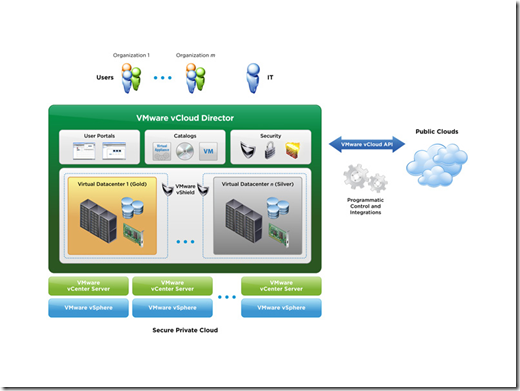
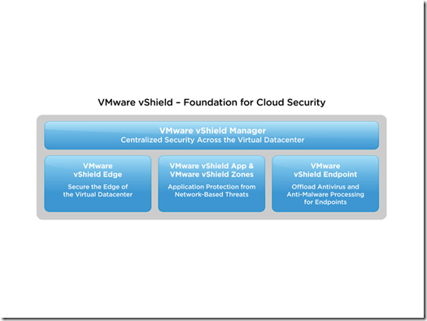

This week a lot of “new” announcements made from the VMworld 2010 conference in San Francisco. Here are some  highlights:

### VMware View 4.5

VMware 4.5 is released. Here are some improvements in version 4.5:

\- Support for VMware vSphere 4.1

\- Full Windows 7 support

\- Offline support

\- View client for Mac

\- ThinApp entitlement

\- Storage tiering, The website [My virtual cloud](http://myvirtualcloud.net/?p=1137&utm_source=feedburner&utm_medium=feed&utm_campaign=Feed%3A+Myvirtualcloudnet+%28myvirtualcloud.net%29) has a good post on this subject.

\- Role Based delegation

\- ThinApp package assignment, Link video.

The profile management (RTO software) solution is not included in this release and the security server does still not support the PCoIP protocol!

More information on VMware View 4.5 can be found on the VMware View [product page](http://www.vmware.com/products/view/) or on the VMware View blog.

### VMware View client for the iPAD

VMware is creating a VMware View client for the iPAD with PCoIP support. Here is a interview with Warren Ponder, the product manager for the VMware View iPad client.

Wyse has the PocketCloud application for the iPhone or iPAD. The Wyse Pocketcloud uses the RDP protocol for connecting to VMware View desktops. The PCoIP protocol is not supported yet.

### vSphere Management app for the iPAD

VMware is developing a vSphere management application for the iPAD.  Click on this [link](http://www.youtube.com/watch?v=H5aAYOy2RPE&feature=player_embedded#!) for a demo.

### VMware Converter standalone 4.3

The VMware vCenter Converter Standalone 4.3 includes the following new functionality:

\- Support for VMware vSphere 4.1 as source and destination targets

\- Support for importing powered-off Microsoft Hyper-V R1 and Hyper-V R2

\- Public API and sample code for submitting and monitoring Converter jobs

\- Support for importing Windows 7 and Windows 2008 R2 sources

\- Ability to throttle the data transfer from source to destination based on network bandwidth or CPU

\- IPv6 support

Discontinued Support options**:** 

\- Support of the following operating systems is discontinued:

**Windows 2000**

**Windows NT**

\- Support for OVF format is discontinued

\- Support for VCB image sources is discontinued

\- Linux installation support is discontinued

The VMware Converter standalone can be downloaded from this [Link](https://www.vmware.com/tryvmware/?p=converter "https://www.vmware.com/tryvmware/?p=converter") 

### End of VMware ESX

The future releases of VMware will only contains ESXi and not ESX anymore. VMware ESX 4.1 is the last version with the full version of VMware ESX including the COS (Service Console).

This was old news that VMware highlighted. Here’s a [link](http://www.youtube.com/user/VMworldTV#p/c/2B426681028B0AFD/14/6Tktk6iIjmI) with an interview with the ESXi team.

### VMware vClould Director (vCD)

Pool virtual infrastructure resources in your existing datacenter and deliver them to users as a catalogue-based service with VMware vCloud Director. Coupled with VMware vSphere™, the best platform for cloud infrastructures, VMware vCloud Director enables customers to build secure private clouds, transforming the way IT delivers and manages infrastructure services and the way users access and consume these services  

For more information visit this [link](http://www.vmware.com/products/vcloud-director/),for a 60 days evaluation this [link](https://www.vmware.com/tryvmware/?p=vcloud-director&lp=1) or an [interview](http://www.youtube.com/user/VMworldTV#p/c/2B426681028B0AFD/5/9oAu2W6uRUE) with product manager Eddie Dinel.

### VMware vShield

VMware announced the three new security products:

\- VMware vShield Endpoint – Offloaded Anti-virus and Anti-Malware

\- VMware vShield App – Application protection from Network–Based Threats

\- VMware vShield Edge – Security for Edge of the Virtual Datacenter

VMware vShield Endpoint is very interesting for VMware View environments. This solution can reduce the IOPS needed for every View desktop.

For more information visit this link.

I hope there are still new announcements over for the VMword 2010 in Copenhagen.

\[nieuw\]
