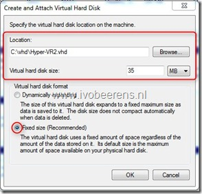
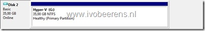
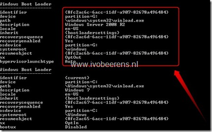
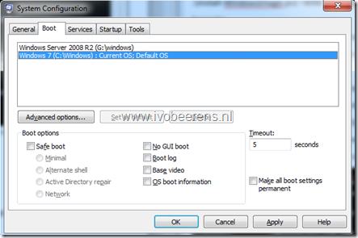

When you want to test some Microsoft Hyper-V R2 stuff it’s handy to do that on your laptop. I test a lot stuff on my laptop equipped with Microsoft Windows 7, 8GB RAM and VMware Workstation. Installing Microsoft Hyper-V R2 for example in VMware Workstation is possible, but it is not possible to start any Virtual Machines (VMs). Microsoft Hyper-V requires a processor with Intel-VT or AMD-V with the No-Execute (NX) feature. In VMware Workstation the virtual CPU has no VT.

So how could I test Microsoft Hyper-V R2 and start VMs on my laptop? The solution is by using **Virtual Hard Disks (VHDs).**

Microsoft Windows 7 and Microsoft Windows 2008 R2 provides native support for Virtual Hard Disks (VHD). With Windows 7 (Enterprise and Ultimate editions) and Windows 2008 R2 (All versions except Windows 2008 R2 Foundation) you can create, configure and boot from VHD.

Here’s how to create, install and boot the VHD equipped with Microsoft WIndows 2008 R2 (so you could install the Microsoft Hyper-V role) in Microsoft Windows 7.

**Step 1 Create a VHD using Disk Management**

- In Microsoft Windows 7 open Disk Management (diskmgmt.msc)
- From the Action menu choose ‘Create VHD’
- Select the location to store the VHD disk file and choose a VHD size. For the best performance use a fixed size.

- Initialize the VHD disk and assign a drive letter, a name and format the disk. In this example the VHD has drive letter G.

**Step 2 Transfer the image to the VHD**

- Mount the ISO image of Windows 2008 R2 (available for MSDN and TechNet subscribers). The ISO contains multiple images of different versions of Windows 2008 R2 and Windows 7. Here’s a list with the corresponding index number and the WIM images (found in the Install.wim).

<table style="border-bottom: medium none; border-left: medium none; border-collapse: collapse; border-top: medium none; border-right: medium none; mso-border-alt: solid gray 1.5pt; mso-yfti-tbllook: 480; mso-padding-alt: 0cm 4.3pt 0cm 4.3pt; mso-border-insideh: .75pt solid gray; mso-border-insidev: .75pt solid gray" class="MsoNormalTable" border="1" cellspacing="0" cellpadding="0"><tbody><tr style="mso-yfti-irow: 0; mso-yfti-firstrow: yes"><td style="border-bottom: gray 1pt solid; border-left: gray 1.5pt solid; padding-bottom: 0cm; padding-left: 4.3pt; width: 89.8pt; padding-right: 4.3pt; background: #d9d9d9; border-top: gray 1.5pt solid; border-right: gray 1pt solid; padding-top: 0cm; mso-border-top-alt: 1.5pt; mso-border-left-alt: 1.5pt; mso-border-bottom-alt: .5pt; mso-border-right-alt: .75pt; mso-border-color-alt: gray; mso-border-style-alt: solid" valign="top" width="120">
<b style="mso-bidi-font-weight: normal">Index</b>
</td><td style="border-bottom: gray 1pt solid; padding-bottom: 0cm; padding-left: 4.3pt; width: 350.8pt; padding-right: 4.3pt; background: #d9d9d9; border-left-color: #f0f0f0; border-top: gray 1.5pt solid; border-right: gray 1.5pt solid; padding-top: 0cm; mso-border-top-alt: 1.5pt; mso-border-left-alt: .75pt; mso-border-bottom-alt: .5pt; mso-border-right-alt: 1.5pt; mso-border-color-alt: gray; mso-border-style-alt: solid" valign="top" width="468">
<b style="mso-bidi-font-weight: normal">Operating System Edition</b>
</td></tr></tbody><tbody><tr style="mso-yfti-irow: 1"><td style="border-bottom: gray 1pt solid; border-left: gray 1.5pt solid; padding-bottom: 0cm; background-color: transparent; border-top-color: #f0f0f0; padding-left: 4.3pt; width: 89.8pt; padding-right: 4.3pt; border-right: gray 1pt solid; padding-top: 0cm; mso-border-alt: solid gray .75pt; mso-border-top-alt: solid gray .75pt; mso-border-left-alt: solid gray 1.5pt" valign="top" width="120">
1
</td><td style="border-bottom: gray 1pt solid; padding-bottom: 0cm; background-color: transparent; border-top-color: #f0f0f0; padding-left: 4.3pt; width: 350.8pt; padding-right: 4.3pt; border-left-color: #f0f0f0; border-right: gray 1.5pt solid; padding-top: 0cm; mso-border-alt: solid gray .75pt; mso-border-top-alt: solid gray .75pt; mso-border-left-alt: solid gray .75pt; mso-border-right-alt: solid gray 1.5pt" valign="top" width="468">
Windows 7 Enterprise
</td></tr><tr style="mso-yfti-irow: 2"><td style="border-bottom: gray 1pt solid; border-left: gray 1.5pt solid; padding-bottom: 0cm; background-color: transparent; border-top-color: #f0f0f0; padding-left: 4.3pt; width: 89.8pt; padding-right: 4.3pt; border-right: gray 1pt solid; padding-top: 0cm; mso-border-alt: solid gray .75pt; mso-border-top-alt: solid gray .75pt; mso-border-left-alt: solid gray 1.5pt" valign="top" width="120">
4
</td><td style="border-bottom: gray 1pt solid; padding-bottom: 0cm; background-color: transparent; border-top-color: #f0f0f0; padding-left: 4.3pt; width: 350.8pt; padding-right: 4.3pt; border-left-color: #f0f0f0; border-right: gray 1.5pt solid; padding-top: 0cm; mso-border-alt: solid gray .75pt; mso-border-top-alt: solid gray .75pt; mso-border-left-alt: solid gray .75pt; mso-border-right-alt: solid gray 1.5pt" valign="top" width="468">
Windows 7 Ultimate
</td></tr><tr style="mso-yfti-irow: 3"><td style="border-bottom: gray 1pt solid; border-left: gray 1.5pt solid; padding-bottom: 0cm; background-color: transparent; border-top-color: #f0f0f0; padding-left: 4.3pt; width: 89.8pt; padding-right: 4.3pt; border-right: gray 1pt solid; padding-top: 0cm; mso-border-alt: solid gray .75pt; mso-border-top-alt: solid gray .75pt; mso-border-left-alt: solid gray 1.5pt" valign="top" width="120">
1
</td><td style="border-bottom: gray 1pt solid; padding-bottom: 0cm; background-color: transparent; border-top-color: #f0f0f0; padding-left: 4.3pt; width: 350.8pt; padding-right: 4.3pt; border-left-color: #f0f0f0; border-right: gray 1.5pt solid; padding-top: 0cm; mso-border-alt: solid gray .75pt; mso-border-top-alt: solid gray .75pt; mso-border-left-alt: solid gray .75pt; mso-border-right-alt: solid gray 1.5pt" valign="top" width="468">
Windows Server 2008 R2 Standard (Full Installation)
</td></tr><tr style="mso-yfti-irow: 4"><td style="border-bottom: gray 1pt solid; border-left: gray 1.5pt solid; padding-bottom: 0cm; background-color: transparent; border-top-color: #f0f0f0; padding-left: 4.3pt; width: 89.8pt; padding-right: 4.3pt; border-right: gray 1pt solid; padding-top: 0cm; mso-border-alt: solid gray .75pt; mso-border-top-alt: solid gray .75pt; mso-border-left-alt: solid gray 1.5pt" valign="top" width="120">
2
</td><td style="border-bottom: gray 1pt solid; padding-bottom: 0cm; background-color: transparent; border-top-color: #f0f0f0; padding-left: 4.3pt; width: 350.8pt; padding-right: 4.3pt; border-left-color: #f0f0f0; border-right: gray 1.5pt solid; padding-top: 0cm; mso-border-alt: solid gray .75pt; mso-border-top-alt: solid gray .75pt; mso-border-left-alt: solid gray .75pt; mso-border-right-alt: solid gray 1.5pt" valign="top" width="468">
Windows Server 2008 R2 Standard (Server Core Installation)
</td></tr><tr style="mso-yfti-irow: 5"><td style="border-bottom: gray 1pt solid; border-left: gray 1.5pt solid; padding-bottom: 0cm; background-color: transparent; border-top-color: #f0f0f0; padding-left: 4.3pt; width: 89.8pt; padding-right: 4.3pt; border-right: gray 1pt solid; padding-top: 0cm; mso-border-alt: solid gray .75pt; mso-border-top-alt: solid gray .75pt; mso-border-left-alt: solid gray 1.5pt" valign="top" width="120">
3
</td><td style="border-bottom: gray 1pt solid; padding-bottom: 0cm; background-color: transparent; border-top-color: #f0f0f0; padding-left: 4.3pt; width: 350.8pt; padding-right: 4.3pt; border-left-color: #f0f0f0; border-right: gray 1.5pt solid; padding-top: 0cm; mso-border-alt: solid gray .75pt; mso-border-top-alt: solid gray .75pt; mso-border-left-alt: solid gray .75pt; mso-border-right-alt: solid gray 1.5pt" valign="top" width="468">
Windows Server 2008 R2 Enterprise (Full Installation)
</td></tr><tr style="mso-yfti-irow: 6"><td style="border-bottom: gray 1pt solid; border-left: gray 1.5pt solid; padding-bottom: 0cm; background-color: transparent; border-top-color: #f0f0f0; padding-left: 4.3pt; width: 89.8pt; padding-right: 4.3pt; border-right: gray 1pt solid; padding-top: 0cm; mso-border-alt: solid gray .75pt; mso-border-top-alt: solid gray .75pt; mso-border-left-alt: solid gray 1.5pt" valign="top" width="120">
4
</td><td style="border-bottom: gray 1pt solid; padding-bottom: 0cm; background-color: transparent; border-top-color: #f0f0f0; padding-left: 4.3pt; width: 350.8pt; padding-right: 4.3pt; border-left-color: #f0f0f0; border-right: gray 1.5pt solid; padding-top: 0cm; mso-border-alt: solid gray .75pt; mso-border-top-alt: solid gray .75pt; mso-border-left-alt: solid gray .75pt; mso-border-right-alt: solid gray 1.5pt" valign="top" width="468">
Windows Server 2008 R2 Enterprise (Server Core Installation)
</td></tr><tr style="mso-yfti-irow: 7"><td style="border-bottom: gray 1pt solid; border-left: gray 1.5pt solid; padding-bottom: 0cm; background-color: transparent; border-top-color: #f0f0f0; padding-left: 4.3pt; width: 89.8pt; padding-right: 4.3pt; border-right: gray 1pt solid; padding-top: 0cm; mso-border-alt: solid gray .75pt; mso-border-top-alt: solid gray .75pt; mso-border-left-alt: solid gray 1.5pt" valign="top" width="120">
5
</td><td style="border-bottom: gray 1pt solid; padding-bottom: 0cm; background-color: transparent; border-top-color: #f0f0f0; padding-left: 4.3pt; width: 350.8pt; padding-right: 4.3pt; border-left-color: #f0f0f0; border-right: gray 1.5pt solid; padding-top: 0cm; mso-border-alt: solid gray .75pt; mso-border-top-alt: solid gray .75pt; mso-border-left-alt: solid gray .75pt; mso-border-right-alt: solid gray 1.5pt" valign="top" width="468">
Windows Server 2008 R2 Datacenter (Full Installation)
</td></tr><tr style="mso-yfti-irow: 8"><td style="border-bottom: gray 1pt solid; border-left: gray 1.5pt solid; padding-bottom: 0cm; background-color: transparent; border-top-color: #f0f0f0; padding-left: 4.3pt; width: 89.8pt; padding-right: 4.3pt; border-right: gray 1pt solid; padding-top: 0cm; mso-border-alt: solid gray .75pt; mso-border-top-alt: solid gray .75pt; mso-border-left-alt: solid gray 1.5pt" valign="top" width="120">
6
</td><td style="border-bottom: gray 1pt solid; padding-bottom: 0cm; background-color: transparent; border-top-color: #f0f0f0; padding-left: 4.3pt; width: 350.8pt; padding-right: 4.3pt; border-left-color: #f0f0f0; border-right: gray 1.5pt solid; padding-top: 0cm; mso-border-alt: solid gray .75pt; mso-border-top-alt: solid gray .75pt; mso-border-left-alt: solid gray .75pt; mso-border-right-alt: solid gray 1.5pt" valign="top" width="468">
Windows Server 2008 R2 Datacenter (Server Core Installation)
</td></tr><tr style="mso-yfti-irow: 9"><td style="border-bottom: gray 1pt solid; border-left: gray 1.5pt solid; padding-bottom: 0cm; background-color: transparent; border-top-color: #f0f0f0; padding-left: 4.3pt; width: 89.8pt; padding-right: 4.3pt; border-right: gray 1pt solid; padding-top: 0cm; mso-border-alt: solid gray .75pt; mso-border-top-alt: solid gray .75pt; mso-border-left-alt: solid gray 1.5pt" valign="top" width="120">
7
</td><td style="border-bottom: gray 1pt solid; padding-bottom: 0cm; background-color: transparent; border-top-color: #f0f0f0; padding-left: 4.3pt; width: 350.8pt; padding-right: 4.3pt; border-left-color: #f0f0f0; border-right: gray 1.5pt solid; padding-top: 0cm; mso-border-alt: solid gray .75pt; mso-border-top-alt: solid gray .75pt; mso-border-left-alt: solid gray .75pt; mso-border-right-alt: solid gray 1.5pt" valign="top" width="468">
Windows Web Server 2008 R2 (Full Installation)
</td></tr><tr style="mso-yfti-irow: 10; mso-yfti-lastrow: yes"><td style="border-bottom: gray 1.5pt solid; border-left: gray 1.5pt solid; padding-bottom: 0cm; background-color: transparent; border-top-color: #f0f0f0; padding-left: 4.3pt; width: 89.8pt; padding-right: 4.3pt; border-right: gray 1pt solid; padding-top: 0cm; mso-border-top-alt: .75pt; mso-border-left-alt: 1.5pt; mso-border-bottom-alt: 1.5pt; mso-border-right-alt: .75pt; mso-border-color-alt: gray; mso-border-style-alt: solid" valign="top" width="120">
8
</td><td style="border-bottom: gray 1.5pt solid; padding-bottom: 0cm; background-color: transparent; border-top-color: #f0f0f0; padding-left: 4.3pt; width: 350.8pt; padding-right: 4.3pt; border-left-color: #f0f0f0; border-right: gray 1.5pt solid; padding-top: 0cm; mso-border-top-alt: solid gray .75pt; mso-border-left-alt: solid gray .75pt" valign="top" width="468">
Windows Web Server 2008 R2 (Server Core Installation)
</td></tr></tbody></table>

Now we need to apply he WIM image to the VHD partition by  using the  ‘**Install-WindowsImage.ps1’** PowerShell script. This Powershell script does the following:

> The Install-WindowsImage PowerShell script uses the wimgapi.dll in Windows 7 or Windows Server 2008 R2 to apply a Windows image in a .wim file to a specified location. The script can be used to apply a Windows 7 or Windows Server 2008 R2 .wim image to a Virtual Hard Disk (VHD) used for native VHD boot or to boot in a Hyper-V virtual machine.

- Download the ‘Install-WindowsImage’ PowerShell script [here](http://code.msdn.microsoft.com/InstallWindowsImage).
- Open PowerShell and and use the following syntax to apply the image to the VHD.:
- .\\Install-WindowsImage.ps1 –WIM  <CDROMDriveLetter\\sources\\install.wim> -Apply -Index WIMimagenumber –Destination <VHD Drive>

> Example:
> 
> .\\Install-WindowsImage.ps1 -WIM Z:\\sources\\install.wim -Apply -Index 3 -Destination G:

- The WIM image is now applying to the VHD. This can take up to 15 minutes.

**Step 3 Prepare the VHD image for native boot**

- Open the command prompt (**RUN as Administrator**)
- Create a new Boot Configuration Data (BCD) entry for native boot using the following syntax:

> g:\\Windows\\System32\\bcdboot g:\\Windows

- Using the command bcdedit command you can see the new boot entry pointing to the VHD image

- To change the default boot options use the **bcdedit –v** command to list the associated GUID numbers. Use the **bcdedit  / default  {GUID}** command to set the default boot config. A easier option is to use the **MSCONFIG** command to set the default boot entry and the timeout.

 

When restarting Microsoft Windows 7, there is an extra option for booting the  Windows 2008 R2 server OS and your able to install the Microsoft Hyper-V R2 role.

More information can be found in the  Microsoft Windows 2008 R2 Getting Started with Virtual Hard Disks document.
