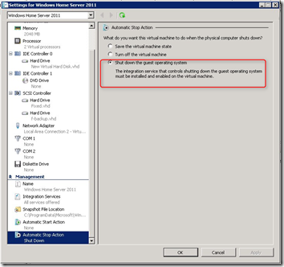
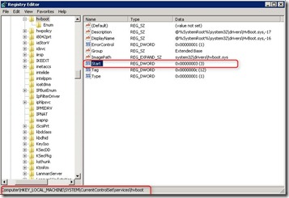
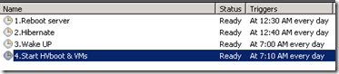

For my MS Hyper-V home server I want to hibernate every day between 12.30 and 07.00 am. When the Hyper-V role is installed, it is not possible to use the hibernate function. The following steps make it possible to automatic hibernate the system and when it wake up, the Hyper-V service and the VM(s) are started.

Steps:

**1.** Download “PowerShell Management Library for Hyper-V” file found [here](http://pshyperv.codeplex.com/). Unblock the zone information from this zip, extract it and run the install file. Copy the content in the “HyperV\_install” folder to **“%windir%\\System32\\WindowsPowerShell\\v1.0\\Modules\\HyperV**”

**2.** Edit VM properties of all VMs. Set the Automatic stop action “Shut down the guest operating system”

**3.** Edit the registy to disable auto start the **hvboot** service. When installing the hyper-v role the hibernate and sleep functionality is disabled.  There is no way to use the hiberate or sleep functionality while the Hyper-v service is running.  The Start property of a service can have the following values:

0=Boot  
1=System (default)  
2=Auto  
**3=Demand**  
4=Disabled

Set the value to 3, so that you can start the service when you want. 0 is not supported for hvboot. Information found [here](http://blogs.msdn.com/b/tejas/archive/2009/03/10/hibernate-and-sleep-with-hyper-v-role-enabled.aspx).

Reboot the server so that the hvboot service is not started.

**4.** Create 4 schedule tasks to run every day.

<table border="0" cellspacing="0" cellpadding="2" width="400"><tbody><tr><td valign="top" width="133"><strong>Name</strong></td><td valign="top" width="133"><strong>Time</strong></td><td valign="top" width="133"><strong>Action</strong></td></tr><tr><td valign="top" width="133">1.Reboot Server</td><td valign="top" width="133">12.30 am</td><td valign="top" width="133">shutdown /r t 30</td></tr><tr><td valign="top" width="133">2.Hibernate</td><td valign="top" width="133">12.40 am</td><td valign="top" width="133">shutdown /h</td></tr><tr><td valign="top" width="133">3.Wake Up</td><td valign="top" width="133">07.00 am</td><td valign="top" width="133">Under conditions select “Wake the computer to run this task”</td></tr><tr><td valign="top" width="133">4.Start HVboot &amp; VMs</td><td valign="top" width="133">07.10 am</td><td valign="top" width="133">powershell.exe -command "c:\powershell\startvm.ps1"</td></tr></tbody></table>

 

The **startvm.ps1** script contains the following Powershell syntax:

<table style="border-collapse: separate" border="0" cellspacing="0" cellpadding="5"><tbody><tr><td style="border-bottom-style: none; padding-bottom: 5px; border-left-style: none; padding-left: 5px; padding-right: 5px; border-top-style: none; border-right-style: none; padding-top: 5px" valign="top">
001 002 003 
</td><td style="border-bottom-style: none; padding-bottom: 5px; border-left-style: none; padding-left: 5px; padding-right: 5px; border-top-style: none; border-right-style: none; padding-top: 5px" valign="top" nowrap="nowrap">
import-module&nbsp;hyperv start-service&nbsp;hvboot start-vm&nbsp;-vm&nbsp;"Windows Home Server 2011"
</td></tr></tbody></table>

Test if the schedule tasks are running fine by manually execute them and you’re ready to hibernate.
