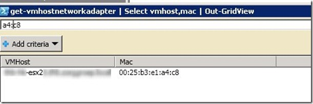

When trying to delete an “old” VMDK file,  I've got  the following message “device **or resource is busy**”. I was pretty sure that the VMDK was not connected to any VM(s) anymore. I tried to delete the VMDK by command line and by using the datastore browser.

I found the VMware KB article  “[Virtual machine does not power on because of locked files”](http://kb.vmware.com/selfservice/microsites/search.do?language=en_US&cmd=displayKC&externalId=10051)

This KB article describes how to find the VMware ESX host that holds the lock.

To identify the VMware ESX server that holds the lock, used the following command:

> vmkfstools -D /vmfs/volumes/<LUN/<name server.VMDK>

This command reports in the vmkernel.log the MAC address of the ESX server that holds the lock. Look in the vmkernel.log by using the following command:

> tail /var/log/vmkernel log

The vmkernel.log output:

> Mar 29 15:43:07 server vmkernel: 7:03:34:25.713 cpu9:4223)FS3: 142: <START                                                                                                                                                              server-flat.vmdk>  
> Mar 29 15:43:07 server vmkernel: 7:03:34:25.713 cpu9:4223)Lock \[type 10c00                                                                                                                                                             001 offset 31932416 v 142, hb offset 3272704  
> Mar 29 15:43:07 server vmkernel: gen 99305, mode 1, owner 4d39b32d-ef56720                                                                                                                                                            9-7754-**0025b3e1a4c8** mtime 3227617\]

The bold text is the MAC address of the VMware ESX server that holds the lock. Now we need to find the VMware ESX server that matches the MAC address. The following PowerCLI script displays all MAC address of all VMware ESX servers and displays this in a gridview.

<table style="border-collapse: separate" border="0" cellspacing="0" cellpadding="5"><tbody><tr><td style="border-bottom-style: none; padding-bottom: 5px; border-left-style: none; padding-left: 5px; padding-right: 5px; border-top-style: none; border-right-style: none; padding-top: 5px" valign="top">
001 
</td><td style="border-bottom-style: none; padding-bottom: 5px; border-left-style: none; padding-left: 5px; padding-right: 5px; border-top-style: none; border-right-style: none; padding-top: 5px" valign="top" nowrap="nowrap">
Connect-viserver vCenterserver

Get-vmhostnetworkadapter&nbsp;|&nbsp;Select&nbsp;vmhost,mac&nbsp;|&nbsp;Out-GridView
</td></tr></tbody></table>

With a gridview it is possible to filter easily. Add the last part of the MAC address (including the : ) and the corresponding VMware ESX server is displayed:

On the VMware server that holds the lock restart the Management agents by using the following command:

> service mgmt-vmware restart

The lock disappeared and I was able to remove the VMDK file.
