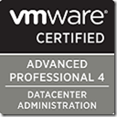

I took the VCAP-DCA (VDCA410) exam on 12 May 2011 at Global Knowledge in Nieuwegein (The Netherlands). Today 27 May 2011 I received an e-mail that I passed the VCAP-DCA exam! Great news before the weekend!

Here are some VCAP-DCA exam requirements:

\- The exam time is 4 hours (time is for non English speaking countries)

\- The passing score is 300 out of 500

\- It takes up to business days 10 days (or more :-) before you know if you passed the exam

\- [Scheduling for the VCAP-DCA exam can be done by the Pearson VUE’s website](http://www.pearsonvue.com/vmware)

Don’t underestimated the exam, it’s a hard one! I was sweating for four 4 hours and didn’t finished all the questions because the time stops. 

The exam is all lab based so you need to do stuff as configuring and troubleshooting vSphere environments. You need to compete tasks they asked. The best advise is to create your own test lab environment as mentioned in the exam blueprint. Then use the blueprint and  practice the objectives. The VMware PDF documents are available but try to avoid because they cost valuable time. So don’t rely on the PDFs! Go to the toilet before the exam several times till nothing is coming out. After three hours I needed to go but I had no time. It’s not a good feeling to hold it………….

The following preparation materials I used:

\- [VMware Certified Advanced Professional Datacenter Administration Exam Blueprint](http://mylearn.vmware.com/mgrReg/register.cfm?course=70779&user=0&operator=0&pwd=&order=0&n=0&mL_method=register&rMethod=register&ui=www_cert&token=none)

\- [VMware VCAP-DCA mock test exam](http://www.vmware.com/go/vcap)

\- [VCAP Community](http://communities.vmware.com/community/vmtn/certedu/certification/vcap)

\- Trainsignal VMware vSphere Troubleshooting training

\- [Edward Grigson vExperienced VCAP-DCA study guide](http://www.vexperienced.co.uk/vcap-dca/)

\- [Sean Crookston VCAP-DCA study guide](http://www.seancrookston.com/vcap-dca/)

\- [Virtual Vargi VCAP-DCA videos](http://virtual-vargi.blogspot.com/p/vcap-dca.html)

\- [My own VMware VCAP-DCA exam command-line cheat sheet](https://www.ivobeerens.nl/?p=830)

When I know my VCAP-DCA number I updated the post and if you have  preparation resources please let me know. Good luck with the preparation for the VCAP-DCA exam!

