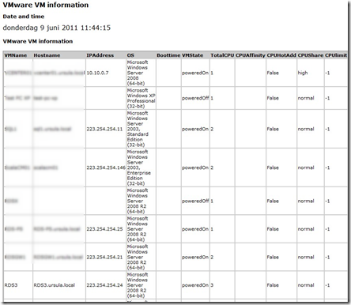
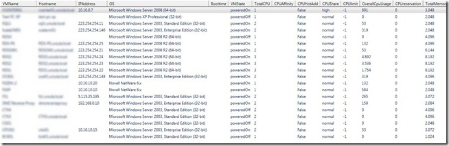

This PowerCLI script will display specified VM settings for all VMs in the vCenter server you specify. If you do an inventory, a health check or need to troubleshoot VMware environment this PowerCLI script can be useful.

The following VM settings will be displayed:

VMName, Hostname, IP address, OS version, Boottime, VMstate, Total vCPUs, CPU afinnity, CPU hot add status, CPU share, CPU limit, Overall CPU usage, CPU reservation, Total memory, Memory share, Memory usage, Memory hot add status, Memory limit, Memory reservation, Memory swap, Memory ballooning, Memory compression, Total NICs, VMware tools status, VMware Tools version, VM hardware version, Timesync status and CBT status.

The output can be specified in the scripts. The following formats:

\- CSV

\- HTML

\- GridView. The cool about gridview is that you can easily sort and filter columns.

\- On screen

\- HTML file can be send by email.

**Requirements:**

\- Microsoft Powershell v2.0

\- VMware PowerCLI 4.1 U1 build 332441

**What do I need to change:**

The following variables can be changed to suit your needs:

<table style="border-collapse: separate" border="0" cellspacing="0" cellpadding="5"><tbody><tr><td style="border-bottom-style: none; padding-bottom: 5px; border-left-style: none; padding-left: 5px; padding-right: 5px; border-top-style: none; border-right-style: none; padding-top: 5px" valign="top">
001 002 003 004 005 006 007 008 009 010 011 012 013 
</td><td style="border-bottom-style: none; padding-bottom: 5px; border-left-style: none; padding-left: 5px; padding-right: 5px; border-top-style: none; border-right-style: none; padding-top: 5px" valign="top" nowrap="nowrap">
# Variable to change $CreateCSV=&nbsp;"yes" $GridView&nbsp;=&nbsp;"yes" $HTML&nbsp;=&nbsp;"yes" $DisplayHTMLOnScreen&nbsp;=&nbsp;"yes" $EmailHTML&nbsp;=&nbsp;"yes" $SendEmail&nbsp;=&nbsp;"yes" $EmailFrom&nbsp;=&nbsp;"vm@ivobeerens.nl" $EmailTo&nbsp;=&nbsp;"info@ivobeerens.nl" $EmailSubject&nbsp;=&nbsp;"VMs settings information" $EmailSMTP&nbsp;=&nbsp;"smtpserver" $FileHTML&nbsp;=&nbsp;New-Item&nbsp;-type&nbsp;file&nbsp;"D:\temp\VMInfo_$datefile.html" $FileCSV&nbsp;=&nbsp;New-Item&nbsp;-type&nbsp;file&nbsp;"D:\temo\VMInfo_$datefile.csv"
</td></tr></tbody></table>

**The PowerCLI script listing**:

<table style="border-collapse: separate" border="0" cellspacing="0" cellpadding="5"><tbody><tr><td style="border-bottom-style: none; padding-bottom: 5px; border-left-style: none; padding-left: 5px; padding-right: 5px; border-top-style: none; border-right-style: none; padding-top: 5px" valign="top">
001 002 003 004 005 006 007 008 009 010 011 012 013 014 015 016 017 018 019 020 021 022 023 024 025 026 027 028 029 030 031 032 033 034 035 036 037 038 039 040 041 042 043 044 045 046 047 048 049 050 051 052 053 054 055 056 057 058 059 060 061 062 063 064 065 066 067 068 069 070 071 072 073 074 075 076 077 078 079 080 081 082 083 084 085 086 087 088 089 090 091 092 093 094 095 096 097 098 099 100 101 102 103 104 105 106 107 108 109 110 111 112 113 114 115 116 117 118 119 120 121 122 123 
</td><td style="border-bottom-style: none; padding-bottom: 5px; border-left-style: none; padding-left: 5px; padding-right: 5px; border-top-style: none; border-right-style: none; padding-top: 5px" valign="top" nowrap="nowrap">
&lt;# .SYNOPSIS Displays VM settings  .DESCRIPTION Display VM settings by CSV, HTML, GridView, screen and as HTML by email &nbsp; .Author(s) Ivo Beerens www.ivobeerens.nl  .EXAMPLE PS C:\&gt; ./vminfo.ps1  #&gt;  #Initialize PowerCLI Add-PSSnapin&nbsp;VMware.VimAutomation.Core C:\"Program Files (x86)\VMware\Infrastructure\vSphere PowerCLI\Scripts\Initialize-PowerCLIEnvironment.ps1"&nbsp;  #Connect to vCenter $VCServer&nbsp;=&nbsp;Read-Host&nbsp;"Enter the vCenter server name" $Username=&nbsp;Read-Host&nbsp;"Enter the username" $Password&nbsp;=&nbsp;Read-Host&nbsp;"Enter password" Connect-VIServer&nbsp;$VCServer&nbsp;-User&nbsp;$username&nbsp;-Password&nbsp;$password&nbsp;-port&nbsp;443  #Variables $Date&nbsp;=&nbsp;get-date $Datefile&nbsp;=&nbsp;(&nbsp;get-date&nbsp;).ToString('yyyy-MM-dd-hhmmss') $ErrorActionPreference&nbsp;=&nbsp;"SilentlyContinue" # Variable to change $CreateCSV=&nbsp;"yes" $GridView&nbsp;=&nbsp;"yes" $HTML&nbsp;=&nbsp;"yes" $DisplayHTMLOnScreen&nbsp;=&nbsp;"yes" $EmailHTML&nbsp;=&nbsp;"yes" $SendEmail&nbsp;=&nbsp;"yes" $EmailFrom&nbsp;=&nbsp;"vm@ivobeerens.nl" $EmailTo&nbsp;=&nbsp;"info@ivobeerens.nl" $EmailSubject&nbsp;=&nbsp;"VMs settings information" $EmailSMTP&nbsp;=&nbsp;"smtpserver" $FileHTML&nbsp;=&nbsp;New-Item&nbsp;-type&nbsp;file&nbsp;"D:\temp\VMInfo_$datefile.html" $FileCSV&nbsp;=&nbsp;New-Item&nbsp;-type&nbsp;file&nbsp;"D:\temo\VMInfo_$datefile.csv"  #Add Text to the HTML file Function&nbsp;Create-HTMLTable { param([array]$Array) $arrHTML&nbsp;=&nbsp;$Array&nbsp;|&nbsp;ConvertTo-Html $arrHTML[-1]&nbsp;=&nbsp;$arrHTML[-1].ToString().Replace('&lt;/body&gt;&lt;/html&gt;',"") Return&nbsp;$arrHTML[5..2000] }  $output&nbsp;=&nbsp;@() $output&nbsp;+=&nbsp;'&lt;html&gt;&lt;head&gt;&lt;/head&gt;&lt;body&gt;' $output&nbsp;+=&nbsp; '&lt;style&gt;table{border-style:solid;border-width:1px;font-size:8pt;background-color:#ccc;width:100%;}th{text-align:left;}td{background-color:#fff;width:20%;border-style:so lid;border-width:1px;}body{font-family:verdana;font-size:12pt;}h1{font-size:12pt;}h2{font-size:10pt;}&lt;/style&gt;' $output&nbsp;+=&nbsp;'&lt;H1&gt;VMware VM information&lt;/H1&gt;' $output&nbsp;+=&nbsp;'&lt;H2&gt;Date and time&lt;/H2&gt;',$date
#Gathering VM settings Write-Host&nbsp;"Gathering VM statistics" $Report&nbsp;=&nbsp;@() Get-VM&nbsp;|&nbsp;Sort&nbsp;Name&nbsp;-Descending&nbsp;|&nbsp;%
&nbsp;{ &nbsp; &nbsp; $vm&nbsp;=&nbsp;Get-View&nbsp;$_.ID &nbsp;&nbsp;&nbsp; $vms&nbsp;=&nbsp;""&nbsp;|&nbsp;Select-Object&nbsp;VMName,&nbsp;Hostname,&nbsp;IPAddress,&nbsp;OS,&nbsp;Boottime,&nbsp;VMState,&nbsp;TotalCPU,&nbsp;CPUAffinity,&nbsp;CPUHotAdd,&nbsp;CPUShare,&nbsp;CPUlimit,&nbsp;OverallCpuUsage,&nbsp;CPUreservation,&nbsp;TotalMemory,&nbsp;MemoryShare,&nbsp;MemoryUsage,&nbsp;MemoryHotAdd,&nbsp;MemoryLimit,&nbsp;MemoryReservation,&nbsp;Swapped,&nbsp;Ballooned,&nbsp;Compressed,&nbsp;TotalNics,&nbsp;ToolsStatus,&nbsp;ToolsVersion,&nbsp;HardwareVersion,&nbsp;TimeSync,&nbsp;CBT &nbsp;&nbsp;&nbsp; $vms.VMName&nbsp;=&nbsp;$vm.Name &nbsp;&nbsp;&nbsp; $vms.Hostname&nbsp;=&nbsp;$vm.guest.hostname $vms.IPAddress&nbsp;=&nbsp;$vm.guest.ipAddress $vms.OS&nbsp;=&nbsp;$vm.Config.GuestFullName $vms.Boottime&nbsp;=&nbsp;$vm.Runtime.BootTime $vms.VMState&nbsp;=&nbsp;$vm.summary.runtime.powerState &nbsp;&nbsp;&nbsp; $vms.TotalCPU&nbsp;=&nbsp;$vm.summary.config.numcpu &nbsp;&nbsp;&nbsp; $vms.CPUAffinity&nbsp;=&nbsp;$vm.Config.CpuAffinity $vms.CPUHotAdd&nbsp;=&nbsp;$vm.Config.CpuHotAddEnabled $vms.CPUShare&nbsp;=&nbsp;$vm.Config.CpuAllocation.Shares.Level $vms.TotalMemory&nbsp;=&nbsp;$vm.summary.config.memorysizemb &nbsp;&nbsp;&nbsp; $vms.MemoryHotAdd&nbsp;=&nbsp;$vm.Config.MemoryHotAddEnabled $vms.MemoryShare&nbsp;=&nbsp;$vm.Config.MemoryAllocation.Shares.Level $vms.TotalNics&nbsp;=&nbsp;$vm.summary.config.numEthernetCards $vms.OverallCpuUsage&nbsp;=&nbsp;$vm.summary.quickStats.OverallCpuUsage &nbsp;&nbsp;&nbsp; $vms.MemoryUsage&nbsp;=&nbsp;$vm.summary.quickStats.guestMemoryUsage &nbsp;&nbsp;&nbsp; $vms.ToolsStatus&nbsp;=&nbsp;$vm.guest.toolsstatus &nbsp;&nbsp;&nbsp; $vms.ToolsVersion&nbsp;=&nbsp;$vm.config.tools.toolsversion $vms.TimeSync&nbsp;=&nbsp;$vm.Config.Tools.SyncTimeWithHost $vms.HardwareVersion&nbsp;=&nbsp;$vm.config.Version &nbsp;&nbsp;&nbsp; $vms.MemoryLimit&nbsp;=&nbsp;$vm.resourceconfig.memoryallocation.limit &nbsp;&nbsp;&nbsp; $vms.MemoryReservation&nbsp;=&nbsp;$vm.resourceconfig.memoryallocation.reservation &nbsp;&nbsp;&nbsp; $vms.CPUreservation&nbsp;=&nbsp;$vm.resourceconfig.cpuallocation.reservation &nbsp;&nbsp;&nbsp; $vms.CPUlimit&nbsp;=&nbsp;$vm.resourceconfig.cpuallocation.limit $vms.CBT&nbsp;=&nbsp;$vm.Config.ChangeTrackingEnabled $vms.Swapped&nbsp;=&nbsp;$vm.Summary.QuickStats.SwappedMemory $vms.Ballooned&nbsp;=&nbsp;$vm.Summary.QuickStats.BalloonedMemory $vms.Compressed&nbsp;=&nbsp;$vm.Summary.QuickStats.CompressedMemory $Report&nbsp;+=&nbsp;$vms }  #Output if&nbsp;($GridView&nbsp;-eq&nbsp;"yes")&nbsp;{ $report&nbsp;|&nbsp;Out-GridView&nbsp;}  if&nbsp;($CreateCSV&nbsp;-eq&nbsp;"yes")&nbsp;{ $report&nbsp;|&nbsp;Export-Csv&nbsp;$FileCSV&nbsp;-NoTypeInformation&nbsp;}  if&nbsp;($HTML&nbsp;-eq&nbsp;"yes")&nbsp;{ $output&nbsp;+=&nbsp;'&lt;p&gt;' $output&nbsp;+=&nbsp;'&lt;H2&gt;VMware VM information&lt;/H2&gt;' $output&nbsp;+=&nbsp;'&lt;p&gt;' $output&nbsp;+=&nbsp;Create-HTMLTable&nbsp;$report $output&nbsp;+=&nbsp;'&lt;/p&gt;' $output&nbsp;+=&nbsp;'&lt;/body&gt;&lt;/html&gt;' $output&nbsp;|&nbsp;Out-File&nbsp;$FileHTML&nbsp;}  if&nbsp;($DisplayHTMLOnScreen&nbsp;-eq&nbsp;"yes")&nbsp;{ ii&nbsp;$FileHTML}  if&nbsp;($SendEmail&nbsp;-eq&nbsp;"yes")&nbsp;{ Send-MailMessage&nbsp;–From&nbsp;$EmailFrom&nbsp;–To&nbsp;$EmailTo&nbsp;–Subject&nbsp;$EmailSubject&nbsp;–SmtpServer&nbsp;$EmailSMTP&nbsp;-Attachments&nbsp;$FileHTML&nbsp;}  #Disconnect session from VC Disconnect-VIserver&nbsp;-Confirm:$false
</td></tr></tbody></table>

Download link
