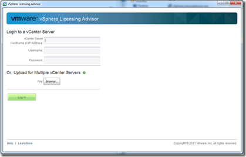

With the announcement of VMware vSphere 5 a complete new license model is introduces.

In VMware vSphere 4 the licensing model was per physical processor based on the number of cores per CPU and the physical memory.

The VMware vSphere 5 license model is based per physical processor and the **allocated** memory (vRAM) across the entire vSphere environment for a particular vSphere 5 edition (pool).

VMware has released a [video](http://download3.vmware.com/media/vsphere/licensing/vs5_licensing_pricing.html) which explains the new vSphere 5 licensing model.

 

**Update August 27, 2012**

**Today VMware announced the end of the vRAM entitlement. More info can be found [here](https://www.ivobeerens.nl/2012/08/27/the-end-of-the-vram-entitlement-in-vmware-vsphere-5-and-5-1/).**

**Update August 15, 2011**

**VMware has announced an update in the licensing for vSphere 5. They listens to their customers and changed the licensing.** **The following things have been updated:**

**\- The vRAM entitlements are increased. See the new entitlements in this post.**

**\- Capped amount of vRAM that is counted for a VM with a max of 1 vSphere Enterprise license (96GB). So an 1TB VM cost 96GB.**

**\- More flexible around transient workloads, and short-term spikes that are typical in test & development environments for example. We will now calculate a 12-month average of consumed vRAM to rather than tracking the high water mark of vRAM.**

**\-** **VMware launched an official tool “****The VMware vSphere Licensing Advisor”. This tool  allows users with vSphere 4.1, vSphere 4.0 and Virtual Infrastructure 3.5 environments to calculate and understand their vRAM usage and vRAM capacity as if they upgraded to vSphere 5.0.**

**Everything in red colored text is updated.**

 

**vSphere 5 licensing facts:**

\- vRAM = virtual memory configured to a Virtual Machine

\- Pooled vRAM = sum of all vRAM entitlements across all vSphere 5 licenses from the same edition in one or more vCenter(s) servers in linked mode

\- Only powered-on VMs a counted in the total vRAM.

\- vRAM pool must be licensed with the same vSphere edition.

\- You can multiple vRAM pools in one or more vCenter servers for example a vSphere 5 standard and vSphere 5 Enterprise license pool

\- The vSphere 4 Advanced edition is removed and customers get a free upgrade to Enterprise

#### vSphere editions and vRAM entitlement

The following vSphere 5 editions are available:

<table border="0" width="641" cellspacing="0" cellpadding="2"><tbody><tr><td valign="top" width="170"><strong>vSphere 5 edition</strong></td><td valign="top" width="235"><strong>Old vRAM (GB) entitlement per Physical CPU</strong></td><td valign="top" width="108"><strong>NEW vRAM (GB) entitlement per Physical CPU</strong></td><td valign="top" width="126"><strong>Max vCPU/VM</strong></td></tr><tr><td valign="top" width="170">vSphere 5 Hypervisor (free version)</td><td valign="top" width="235">8</td><td valign="top" width="108">32 Physical limit (no vRAM entitlement)</td><td valign="top" width="126">8</td></tr><tr><td valign="top" width="170">vSphere 5 Essentials</td><td valign="top" width="235">24 (max. 6 processor license, total 192GB)</td><td valign="top" width="108">32</td><td valign="top" width="126">8</td></tr><tr><td valign="top" width="170">vSphere 5 Essentials plus</td><td valign="top" width="235">24 (max. 6 processor license, total 192GB)</td><td valign="top" width="108">32</td><td valign="top" width="126">8</td></tr><tr><td valign="top" width="170">vSphere 5 Standard</td><td valign="top" width="235">24</td><td valign="top" width="108">32</td><td valign="top" width="126">8</td></tr><tr><td valign="top" width="170">vSphere 5 Enterprise</td><td valign="top" width="235">32</td><td valign="top" width="108">64</td><td valign="top" width="126">8</td></tr><tr><td valign="top" width="170">vSphere 5 Enterprise plus</td><td valign="top" width="244">48</td><td valign="top" width="123">96</td><td valign="top" width="136">32</td></tr></tbody></table>

 

#### How many licenses do I need?

For existing customers before upgrading to vSphere 5 you need to know if the upgrade can without needing extra licenses.

To calculate how many licenses you need to sum up the total amount of vRAM allocated in all the powered-on VMs and divide that to total amount by the for the particular vSphere 5 edition you are running. Here are two customer cases:

 

**Customer example 1**

Stretched cluster across two sites. One VMware vCenter server and 19 VMware vSphere 4 hosts. 2 Clusters.

 

<table border="0" width="617" cellspacing="0" cellpadding="2"><tbody><tr><td valign="top" width="205"><strong>Cluster</strong></td><td valign="top" width="205"><strong>vSphere 4 hosts</strong></td><td valign="top" width="205"><strong>License</strong></td></tr><tr><td valign="top" width="210">Cluster Citrix</td><td valign="top" width="210">10</td><td valign="top" width="209">Standard</td></tr><tr><td valign="top" width="213">Cluster HA&amp;DRS</td><td valign="top" width="213">9</td><td valign="top" width="209">Enterprise</td></tr></tbody></table>

 

vSphere host hardware:

\- HP Proliant DL 380 G6

\- 2 x Intel Xeon 5500 CPUs

\- 48 GB memory

 

<table border="0" width="400" cellspacing="0" cellpadding="2"><tbody><tr><td valign="top" width="200">VMware vSphere hosts</td><td valign="top" width="200">19</td></tr><tr><td valign="top" width="200">License type</td><td valign="top" width="200">vSphere 4 Enterprise (9) vSphere 4 standard (10)</td></tr><tr><td valign="top" width="200">Total CPU licenses</td><td valign="top" width="200">vSphere 4 Enterprise 18 vSphere 4 standard 20</td></tr><tr><td valign="top" width="200">Max pooled vRAM</td><td valign="top" width="200">vSphere Enterprise gives per CPU 64GB, 18 x 64GB = 1152GB Pooled vRAM

vSphere Standard gives per CPU 32GB, 20 x 32GB = 640 GB Pooled vRAM</td></tr><tr><td valign="top" width="200">Current vRAM usage</td><td valign="top" width="200">312 GB Enterprise pool 320 GB Standard pool</td></tr><tr><td valign="top" width="200">Maximum usage RAM (100% use)</td><td valign="top" width="200">432 GB (9 x 48GB) Enterprise 480 GB (10 x 48GB) Standard</td></tr></tbody></table>

 

No additional licenses will be required for this environment.

 

 

 

**Customer example 2**

Two sites, on every site one vCenter server and 4 VMware vSphere 4 hosts with VMware Site Recovery Manager (SRM).

 

vSphere host hardware:

\- HP Proliant DL 380 G7

\- 2 x Intel Xeon 5650 CPUs

\- 72 GB memory

 

 

**Site 1**

 

<table border="0" width="400" cellspacing="0" cellpadding="2"><tbody><tr><td valign="top" width="200">VMware vSphere hosts</td><td valign="top" width="200">4</td></tr><tr><td valign="top" width="200">License type</td><td valign="top" width="200">vSphere 4 Enterprise</td></tr><tr><td valign="top" width="200">Total licenses</td><td valign="top" width="200">8</td></tr><tr><td valign="top" width="200">Max pooled vRAM</td><td valign="top" width="200">vSphere enterprise gives per CPU 64GB, 8 x 64GB = 512GB Pooled vRAM</td></tr><tr><td valign="top" width="200">Current vRAM usage</td><td valign="top" width="200">177 GB</td></tr><tr><td valign="top" width="200">Maximum usage RAM (100% use)</td><td valign="top" width="200">288 GB (4 x 72GB)</td></tr></tbody></table>

 

 

**Site 2**

 

<table border="0" width="400" cellspacing="0" cellpadding="2"><tbody><tr><td valign="top" width="200">VMware vSphere hosts</td><td valign="top" width="200">4</td></tr><tr><td valign="top" width="200">License type</td><td valign="top" width="200">vSphere 4 Enterprise</td></tr><tr><td valign="top" width="200">Total licenses</td><td valign="top" width="200">8</td></tr><tr><td valign="top" width="200">Max pooled vRAM</td><td valign="top" width="200">vSphere enterprise gives per CPU 64GB, 8 x 64GB = 512GB Pooled vRAM</td></tr><tr><td valign="top" width="200">Current vRAM usage</td><td valign="top" width="200">68 GB</td></tr><tr><td valign="top" width="200">Maximum usage RAM (100% use)</td><td valign="top" width="200">288 GB (4 x 72GB)</td></tr></tbody></table>

 

 

No additional licenses will be required for this environment even if the 288 GB RAM cannot be full used. This because of the reservation of  an X amount of memory in your cluster for the hypervisor,  maintenance mode and High Availability (HA).

#### Cons of the new vSphere 5 licensing

VMware listening to there customers and increased for example the vRAM entitlements. To most of the cons do not apply anymore.

 

\- Customers are or going to upgrade to Microsoft Windows 2008 R2. Our Windows 2008 R2 templates are based 4GB of more depending on the task the VM gets. As we take 4GB as average the following 4GB VMs can be placed with 100% memory use:

 

<table border="0" width="624" cellspacing="0" cellpadding="2"><tbody><tr><td valign="top" width="199"><strong>vSphere 5 edition</strong></td><td valign="top" width="283"><strong>vRAM (GB) entitlement per Physical CPU</strong></td><td valign="top" width="140"><strong>Windows 2008 R2 VMs</strong></td></tr><tr><td valign="top" width="199">vSphere 5 Hypervisor (free version)</td><td valign="top" width="283">8 32 physical limit</td><td valign="top" width="140">2 8</td></tr><tr><td valign="top" width="199">vSphere 5 Essentials</td><td valign="top" width="283">24 (max. 6 processor license, total 144GB) 32</td><td valign="top" width="140">6

8</td></tr><tr><td valign="top" width="199">vSphere 5 Essentials plus</td><td valign="top" width="283">24 (max. 6 processor license, total 144 GB) 32</td><td valign="top" width="140">6 8</td></tr><tr><td valign="top" width="199">vSphere 5 Standard</td><td valign="top" width="283">24 32</td><td valign="top" width="140">6 8</td></tr><tr><td valign="top" width="199">vSphere 5 Enterprise</td><td valign="top" width="283">32 64</td><td valign="top" width="140">8 16</td></tr><tr><td valign="top" width="199">vSphere 5 Enterprise plus</td><td valign="top" width="283">48 96</td><td valign="top" width="140">12 24</td></tr></tbody></table>

 

\- The CPU core to memory ratio can be very low. For example for a six core CPU with hyper-treading and a standard license gives a very low ratio 1:1 if we use 4GB VMs. 

 

\- You may loss the the flexibility to scale-up the memory without invest in extra vSphere licenses. I have seen a lot of customers who upgrade the memory of their vSphere hosts within 3 a 4 years. With the new vSphere 5 licensing this can lead in buying extra licenses.

\- The vSphere 5 Hypervisor version supports 8GB per CPU, a dual CPU sockets hosts gives u 16GB RAM. On this server you can place 3,5 Windows 2008 R2 VM with 4GB VMs. I think the vSphere 5 Hypervisor isn’t going to be used anymore because other hypervisors haven't this restriction and even offer more functionality.

\- No benefit for memory technics such as memory over allocation because the licensing is based on virtual memory configured to a Virtual Machine (vRAM)

#### Tools

Before upgrading to vSphere 5 you need to know if the upgrade can without needing extra licenses. Here’s are some great PowerCLI script the examine the vRAM usage and licenses used  in your current vSphere environment:

\- [vSphere Licensing Advisor](http://downloads.vmware.com/d/details/licenseadv10/ZHcqYnQldHdiZCpwcA==). The VMware vSphere Licensing Advisor allows users with vSphere 4.1, vSphere 4.0 and Virtual Infrastructure 3.5 environments to calculate and understand their vRAM usage and vRAM capacity as if they upgraded to vSphere 5.0. The tool will show you the vRAM capacity and usage for each vSphere 5.0 equivalent edition.

\- [License Validator](http://www.virtu-al.net/2011/07/14/vsphere-5-license-entitlements/) by Alan Renouf

\- [Query vRAM](http://www.lucd.info/2011/07/13/query-vram/) by Luc Dekens

\- Calculate vSphere 5 licenses by Hugo Peeters

 

Other stuff:

\- [VMware vSphere 5.0 Licensing, Pricing and Packaging whitepaper](http://www.vmware.com/files/pdf/vsphere_pricing.pdf)

\- [Virtual License Calculator by Rynard Spies](http://www.virtualvcp.com/news/165-my-vmware-vsphere-5-license-calculator-published)

 

VMware has a white paper about the vSphere 5 new licensing structure and can be found [here](http://www.vmware.com/files/pdf/vsphere_pricing.pdf). There is also a vSphere 5 licensing discussion on the [VMware Community](http://communities.vmware.com/thread/320877?start=0&tstart=0).

#### VDI licenses

For VDI desktops VMware a “vSphere Desktop” package license is introduces. This license is a lot easier to understand. For a 100 concurrent desktop license you pay $6500, that is $65 per desktop regardless the processors, memory you have.
