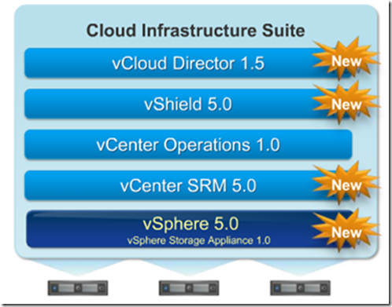

VMware  announced vSphere 5 yesterday. This is the next generation of their Cloud  Infrastructure Suite.

Here’s a list of white papers and technical documents about the new products, features and licensing of VMware vSphere 5:

\- [What's New in VMware vSphere 5.0 Platform](http://www.vmware.com/files/pdf/techpaper/Whats-New-VMware-vSphere-50-Platform-Technical-Whitepaper.pdf)

\- [What's New in VMware vSphere 5.0 Storage](http://www.vmware.com/files/pdf/techpaper/Whats-New-VMware-vSphere-50-Storage-Technical-Whitepaper.pdf)

\- [What's New in VMware vSphere 5.0 Performance](http://www.vmware.com/files/pdf/techpaper/Whats-New-VMware-vSphere-50-Performance-Technical-Whitepaper.pdf)

\- [What's New in VMware vSphere 5.0 Networking](http://www.vmware.com/files/pdf/techpaper/Whats-New-VMware-vSphere-50-Networking-Technical-Whitepaper.pdf)

\- [What's New in VMware vSphere 5.0 Availability](http://www.vmware.com/files/pdf/techpaper/Whats-New-VMware-vSphere-50-Availability-Technical-Whitepaper.pdf)

\- [What's New in VMware vCloud Director 1.5 Technical Whitepaper](http://www.vmware.com/files/pdf/techpaper/Whats-New-VMware-vCloud-Director-15-Technical-Whitepaper.pdf)

\- [What's New in VMware vCenter Site Recovery Manager 5.0 Technical Whitepaper](http://www.vmware.com/files/pdf/techpaper/Whats-New-VMware-vCenter-Site-Recovery-Manager-50-Technical-Whitepaper.pdf)

\- [What's New in VMware Data Recovery 2.0 Technical Whitepaper](http://www.vmware.com/files/pdf/techpaper/Whats-New-VMware-Data-Recovery-20-Technical-Whitepaper.pdf)

\- [VMware vSphere Storage Appliance Technical Whitepaper](http://www.vmware.com/files/pdf/techpaper/VMware-vSphere-Storage-Appliance-Technical-Whitepaper.pdf)

\- [VMware vSphere 5.0 Licensing, Pricing and Packaging](http://www.vmware.com/files/pdf/vsphere_pricing.pdf)

Also the new VMware Certified Professional (VCP 5) exam details are available:

\- [VMware Certified Professional 5 (VCP 5) information](http://mylearn.vmware.com/mgrReg/plan.cfm?plan=12457&ui=www_cert)

\- [VMware VCP5 exam blueprint](http://mylearn.vmware.com/register.cfm?course=103110)

More information on VMware vSphere 5 are covered in future blog post!
