The following three supported upgrade methods to VMware ESXi 5 are available:

<table border="0" cellspacing="0" cellpadding="2" width="580"><tbody><tr><td valign="top" width="173"><strong>Upgrade Method</strong></td><td valign="top" width="146"><strong>ESX or ESXi to ESXi 5</strong></td><td valign="top" width="259"><strong>Upgrade or Patch from ESXi 5.0 to ESXi 5.n</strong></td></tr><tr><td valign="top" width="173"><strong>vSphere Update Manager</strong></td><td valign="top" width="146">yes</td><td valign="top" width="259">yes</td></tr><tr><td valign="top" width="173"><strong>Interactive upgrade from CD, DVD, or USB drive</strong></td><td valign="top" width="146">yes</td><td valign="top" width="259">yes</td></tr><tr><td valign="top" width="173"><strong>Scripted upgrade</strong></td><td valign="top" width="146">yes</td><td valign="top" width="259">yes</td></tr><tr><td valign="top" width="173"><strong>vSphere Auto Deploy</strong></td><td valign="top" width="146">no</td><td valign="top" width="259">yes</td></tr><tr><td valign="top" width="173"><strong>esxcli</strong></td><td valign="top" width="146">no</td><td valign="top" width="259">yes</td></tr></tbody></table>

It is not supported to directly upgrade ESX(i) 3.x to ESXi 5. You must first upgrade ESX(i) 3 to ESX(i) 4 before upgrading to ESXi 5. Another option is to do an fresh installation.

**When upgrading to vSphere ESXi 5 there are a couple of things to think about before starting**:

\- It is now possible to upgrade VMware ESX 4.x and ESXi 4.x to VMware ESXi 5. Prior ESXi 5 the upgrade from ESX to ESXi was not supported (fresh installation needed).

\- Make sure using static IP addresses. DHCP addresses can cause problems when upgrading with VMware Update Manager

\- Backup your ESX or ESXi configuration:

> For ESX back up the /etc/passwd, /etc/groups, /etc/shadow, and /etc/gshadow directories, custom scripts, local VMs, templates, iso and \*.VMX files

> For ESXi use vicfg-cfgbackup command in from the VMA or esxcli

\- If upgrading the host(s) managed by vCenter server, you must upgrade vCenter to version 5 before upgrade ESX or ESXi

\- Once you have upgraded or migrated your host to ESXi 5.0, you cannot roll back to your  
version 4.x ESX or ESXi software.

\- Lopsided boot banks can occur in systems that are upgraded from ESXi 3.5 to ESXi 4.x, and then upgraded directly to ESXi 5.0. vSphere Update Manager assumes the boot banks are both at 250MB.  If it detects one boot bank is smaller than the other it will report an invalid boot disk and won’t even try to upgrade. More information can be found [here](http://blogs.vmware.com/esxi/2011/08/esxi-and-lopsided-bootbanks.html).

\- For most ESXi 4.x hosts, the partition table is not rewritten in the upgrade to ESXi 5.0. The partition table is rewritten for systems that have lopsided bootbanks. Lopsided boot banks can occur in systems that are upgraded from ESXi 3.5 to ESXi 4.x, and then directly to ESXi 5.0.

\- The ESXi 5.0 installer cannot detect ESX 2.x instances or VMFS2 datastores. You cannot migrate ESX 2.x instances to ESXi 5.0 or preserve VMFS2 datastores in an upgrade to ESXi 5.0. Instead, perform a fresh installation of ESXi 5.0.

\- For ESX hosts, the partitioning structure is changed to resemble that of an ESXi 4.x host. The VMFS3 partition is retained and a new MSDOS-based partition table overwrites the existing partition table.

\- Upgraded hosts do not have a scratch partition. Instead, the scratch directory is created and accessed off of the VMFS volume. Each of the other partitions, such as the bootbanks, locker and vmkcore will be identical to thatof any other system.

**The three upgrade methods are described with some screenshots.**

### vSphere Update Manager (VUM) ESX 4 or ESXi 4 to ESXi 5 upgrade

In vCenter open the VUM plug in and import Host Upgrade Image

[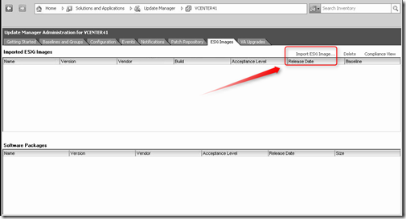](https://www.ivobeerens.nl/wp-content/uploads/2011/08/image9.png)

browse to the VMware vSphere 5i installer ISO

[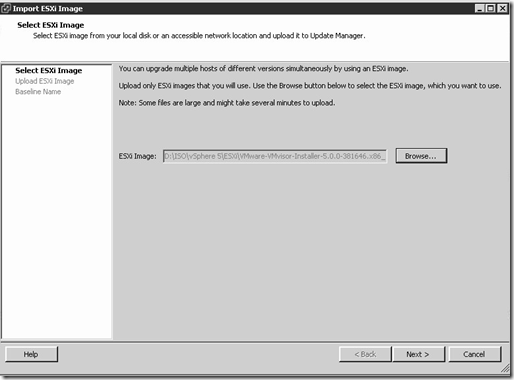](https://www.ivobeerens.nl/wp-content/uploads/2011/08/image10.png)

The ISO is uploaded to VUM.

[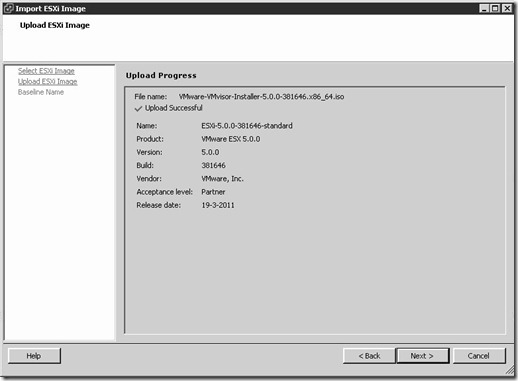](https://www.ivobeerens.nl/wp-content/uploads/2011/08/2011-08-19-10h37_31.jpg)

Create Host Upgrade Baseline

[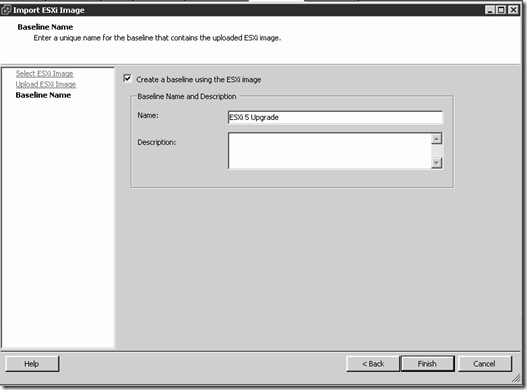](https://www.ivobeerens.nl/wp-content/uploads/2011/08/image11.png)

Attach the baseline

[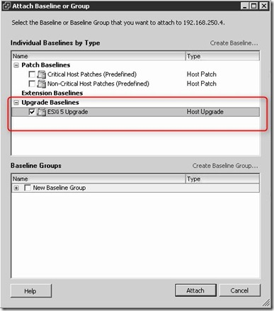](https://www.ivobeerens.nl/wp-content/uploads/2011/08/2011-08-19-10h40_12.jpg)

Perform an scan

[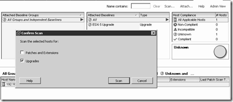](https://www.ivobeerens.nl/wp-content/uploads/2011/08/image12.png)

There is a warning. Click on the 1 to expand the warning

[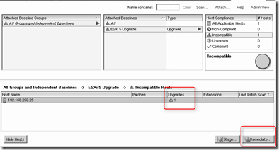](https://www.ivobeerens.nl/wp-content/uploads/2011/08/image13.png)

The following warning is displayed that some modules are removed by the upgrade

[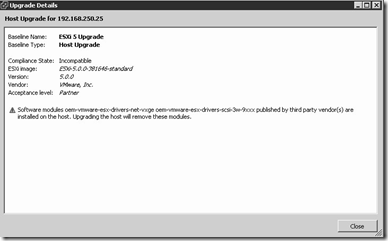](https://www.ivobeerens.nl/wp-content/uploads/2011/08/image14.png)

Click on the Remediate button and follow the steps:

[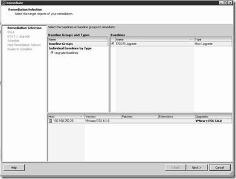](https://www.ivobeerens.nl/wp-content/uploads/2011/08/image15.png)

[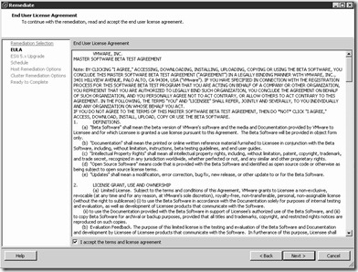](https://www.ivobeerens.nl/wp-content/uploads/2011/08/2011-08-19-11h00_15.jpg)

[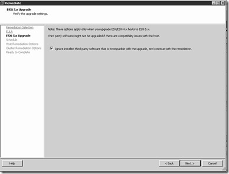](https://www.ivobeerens.nl/wp-content/uploads/2011/08/2011-08-19-11h01_40.jpg)

[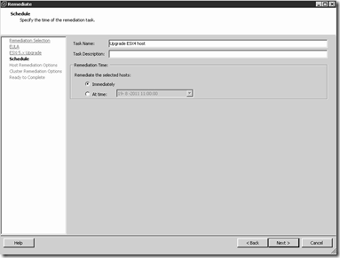](https://www.ivobeerens.nl/wp-content/uploads/2011/08/image16.png)

[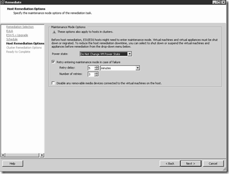](https://www.ivobeerens.nl/wp-content/uploads/2011/08/image17.png)

[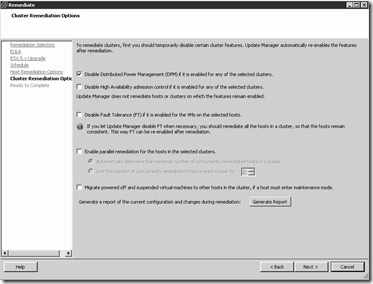](https://www.ivobeerens.nl/wp-content/uploads/2011/08/image18.png)

[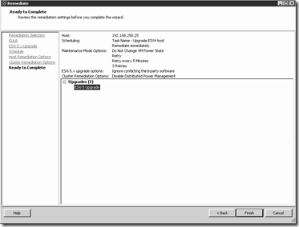](https://www.ivobeerens.nl/wp-content/uploads/2011/08/image19.png)

When the Remediate finish the upgrade is complete and VMware ESXi 5 is installed.

### Steps of the interactive upgrade using the CD/DVD from ESX4 or ESXi 4 to ESXi 5

[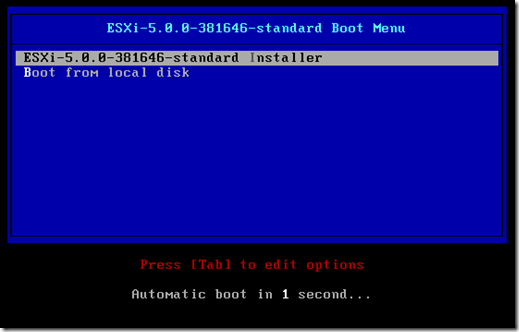](https://www.ivobeerens.nl/wp-content/uploads/2011/08/image2.png)

[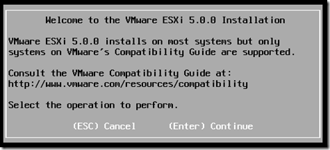](https://www.ivobeerens.nl/wp-content/uploads/2011/08/image3.png)

[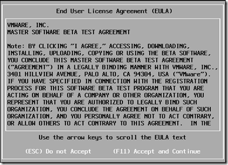](https://www.ivobeerens.nl/wp-content/uploads/2011/08/image4.png)

[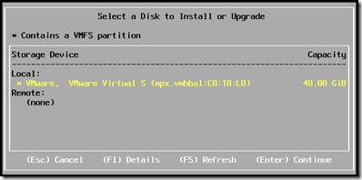](https://www.ivobeerens.nl/wp-content/uploads/2011/08/image5.png)

A existing VMFS volume is found and the following selections can be made:

[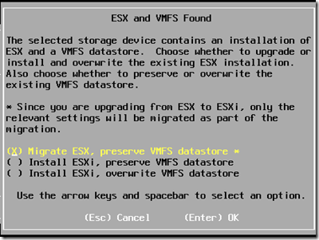](https://www.ivobeerens.nl/wp-content/uploads/2011/08/image6.png)

In this example we migrate VMware ESX 4 to ESXi 5 and choose Migrate ESX, preserver VMFS datastore.

[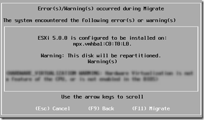](https://www.ivobeerens.nl/wp-content/uploads/2011/08/image7.png)

[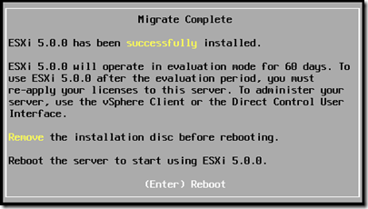](https://www.ivobeerens.nl/wp-content/uploads/2011/08/image8.png)

### Scripted upgrade from ESX4 or ESXi 4  to ESXi 5

Scripted upgrade can be done by using a kickstart text file for example ks.cfg. In this file the following options can be used for the upgrade:

<table border="0" cellspacing="0" cellpadding="2" width="400"><tbody><tr><td valign="top" width="200"><strong>upgrade</strong></td><td valign="top" width="200">Upgrades to ESXi 5</td></tr><tr><td valign="top" width="200"><strong>installorupgrade</strong></td><td valign="top" width="200">Tries to upgrade to ESXi5. If it is not possible to upgrade it will perform a fresh installation.</td></tr></tbody></table>

William Lam has very good information and examples about ESXi 5 scripted installations. For more information see the posts [How to Automate the Upgrade of Classic ESX 4.x to ESXi 5](http://www.virtuallyghetto.com/2011/08/how-to-automate-upgrade-of-classic-esx.html) and [Automating ESXi 5.x Kickstart Tips & Tricks](http://www.virtuallyghetto.com/2011/07/automating-esxi-5x-kickstart-tips.html)

\[ad#banner\]
