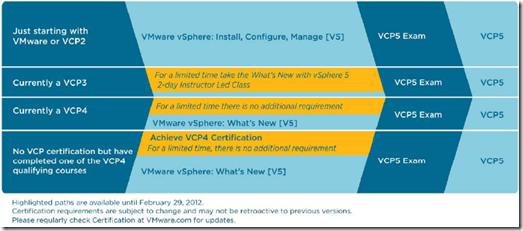

While preparing and studing for the VMware Certified Professional (VCP) 5 exam, I created an overview of resources that could help preparing the VCP5 exam. The VCP5 exam consist of:

\- 85 questions

\- Time limit is 90 minutes. For candidates in a country where English is not the primary language will have additional 30 minutes

\- Passing score is 300 out of 500

\- Scheduling and taking the exam through [Pearson VUE](http://www.pearsonvue.com/vmware)

\- The yellow highlighted paths are available until 29 February 2012

##### General

\- [VMware VCP5 page](http://mylearn.vmware.com/mgrReg/plan.cfm?plan=12457&ui=www_cert)

\- [VCP5 blueprint](http://mylearn.vmware.com/mgrReg/register.cfm?course=103110&user=0&operator=0&pwd=&order=0&n=0&mL_method=register&rMethod=register&ui=www&token=none)

\- [vSphere 5 Maximums](http://www.vmware.com/pdf/vsphere5/r50/vsphere-50-configuration-maximums.pdf)

\- [vSphere 5.0 CLI reference poster](http://blogs.vmware.com/vipowershell/2011/09/powercli-poster-v50.html)

\- [VCP5 documentation notes by Forbes Guthrie](http://www.vreference.com/vsphere-5-notes/)

\- [What’s New in VMware vSphere 5.0 Platform](http://www.vmware.com/files/pdf/techpaper/Whats-New-VMware-vSphere-50-Platform-Technical-Whitepaper.pdf)

\- [What’s New in VMware vSphere 5.0 Storage](http://www.vmware.com/files/pdf/techpaper/Whats-New-VMware-vSphere-50-Storage-Technical-Whitepaper.pdf)

\- [What’s New in VMware vSphere 5.0 Performance](http://www.vmware.com/files/pdf/techpaper/Whats-New-VMware-vSphere-50-Performance-Technical-Whitepaper.pdf)

\- [What’s New in VMware vSphere 5.0 Networking](http://www.vmware.com/files/pdf/techpaper/Whats-New-VMware-vSphere-50-Networking-Technical-Whitepaper.pdf)

\- [What’s New in VMware vSphere 5.0 Availability](http://www.vmware.com/files/pdf/techpaper/Whats-New-VMware-vSphere-50-Availability-Technical-Whitepaper.pdf)

\- [What’s New in VMware vCloud Director 1.5 Technical Whitepaper](http://www.vmware.com/files/pdf/techpaper/Whats-New-VMware-vCloud-Director-15-Technical-Whitepaper.pdf)

\- [What’s New in VMware vCenter Site Recovery Manager 5.0 Technical Whitepaper](http://www.vmware.com/files/pdf/techpaper/Whats-New-VMware-vCenter-Site-Recovery-Manager-50-Technical-Whitepaper.pdf)

\- [What’s New in VMware Data Recovery 2.0 Technical Whitepaper](http://www.vmware.com/files/pdf/techpaper/Whats-New-VMware-Data-Recovery-20-Technical-Whitepaper.pdf)

\- [VMware vSphere Storage Appliance Technical Whitepaper](http://www.vmware.com/files/pdf/techpaper/VMware-vSphere-Storage-Appliance-Technical-Whitepaper.pdf)

\- [VMware vSphere 5.0 Licensing, Pricing and Packaging](http://www.vmware.com/files/pdf/vsphere_pricing.pdf)

##### Forum

[\-VCP Community forum](http://communities.vmware.com/community/vmtn/certedu/certification/vcp)

##### Exam experience

\- [Eric Sloof](http://www.ntpro.nl/blog/archives/1865-Eric-Sloofs-VCP5-exam-experience.html)

\- [vJason](http://www.vjason.com/2011/08/29/vcp5-exam-passed/)

##### Exam preparation

\- [VCP on vSphere 5 Mock Exam](http://mylearn.vmware.com/mgrSurvey/assess.cfm?item=24908&user=0&refer=0&p=0&ui=www_cert)

\- [Simon Long practice exams](http://www.simonlong.co.uk/blog/vcp5-practice-exams/)

##### Books

\- [Mastering VMware vSphere 5 by Scott Lowe](http://www.amazon.com/Mastering-VMware-vSphere-Scott-Lowe/dp/0470890800/ref=sr_1_2?ie=UTF8&qid=1317325003&sr=8-2)

\- [VMware vSphere 5 Clustering Technical Deepdive by Duncan Epping and Frank Denneman](http://www.amazon.com/VMware-vSphere-Clustering-Technical-Deepdive/dp/1463658133/ref=sr_1_1?ie=UTF8&qid=1317325003&sr=8-1)

##### CBT training

\- Trainsignal vSphere 5 training

##### VMware courses available

\- VMware vSphere: Install, Configure, Manage 5.0

\- VMware vSphere: What’s New 5.0  

If you have additional resources let me know.

\[ad#banner\]
