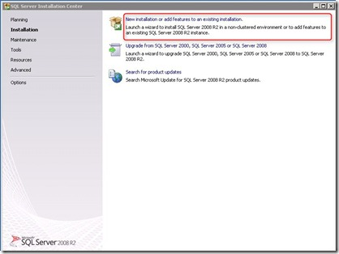
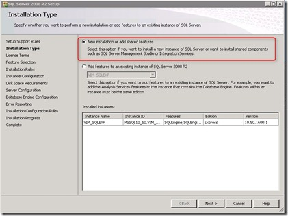
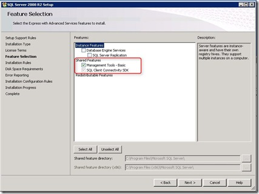
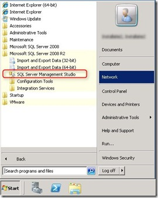

When installing VMware vCenter 5 with the default database engine (Microsoft SQL Server Express 2008 R2) the SQL Management Studio is not installed by default. It can be confusing to add SQL Management studio at a later time. Here are the steps explained:

1\. Download Microsoft SQL Express 2008 R2 (can be found [here](http://www.microsoft.com/sqlserver/en/us/editions/express.aspx)) or browse the vCenter installation ZIP or ISO. The installation package can be found in the “\\redist\\SQLEXPR” folder.

2\. Select “**New Installation or add features to an existing installation**”.

3\. Select “**New installation or add shared features”.**

\- Only select “**Management Tools – Basic**”.

When the installation is completed you see the “SQL Server Management Studio” listed under the start menu.

Important to know is that you need exactly to follow these steps. If you choose the wrong option and  use the back button the “Management Tools – Basic” isn’t listed anymore. Strange….
