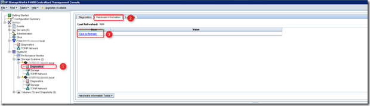
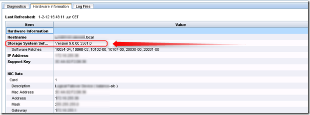
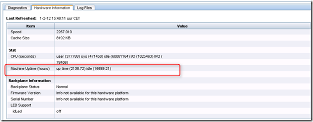

During a health check I needed to know the SAN/iQ version, installed patches and the up-time of the HP P4000 storage nodes because of a nasty bug in SAN/iQ 9.0 or 9.0.01 that hang or reboot nodes after 208.5 days (More information about the bug can be found in the HP Customer Advisory found **here**)

To see the SAN/iQ version, installed patches and the up-time (thanks to Calvin Zito @HPStorageGuy for guiding me to the up-time counter in CMC)

Here are the steps:

**1**. Open the Centralized Management Console (CMC)

**2**. Login

**3**. Expand the cluster

**4**. Expand the Storage Systems

**5.**  Select Diagnostics for the first node (**1**)

**6**. Select “Hardware information” (**2**)

**7**. Select “Click to refresh” (**3**)

**8**. The Storage System Software displays the SAN/iQ version and Software Patches installed:

**9**. Scroll down to the Stat section and look at the Machine Uptime. The up-time is in hours, 2138/24= 89 days up-time for one node.

**10**. Repeat step 5 till 9 for all storage nodes

\[ad#banner\]
