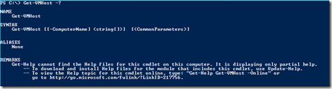
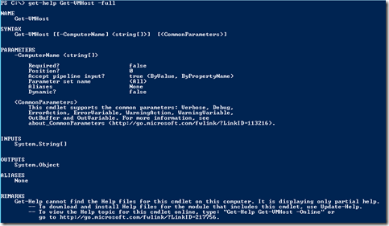

In Windows 2008 & Windows2008 R2 there were no official PowerShell Cmdlets available for Hyper-V. This is changed in Windows 2012 and Windows 8. Windows Server 2012 and 8 has 162 or more PowerShell Cmdlets available for Hyper-V. Windows 8 uses PowerShell version 3.

Cmdlets are very powerful, that lets you automate all aspects of Hyper-V.  Here some guidance how-to find the Cmdlets you need.

To view all the Hyper-V PowerShell Cmdlets:

Get-Command -Module Hyper-V

To search for Cmdlets, for example with the name “host” in it: 

Get-Command -Module Hyper-V -Noun \*host\*

To get the Cmdlet syntax:

Get-VMHost -?

 

Get the Cmdlet syntax and available parameters, details and examples:

get-Help Get-VMHost -Full

More information over the Hyper-V Cmdlets can be found [here](http://technet.microsoft.com/en-us/library/hh848559.aspx). PowerShell 3.0 is available as Community Technology Preview (CTP) found here.

 

 

\[ad#banner\]
