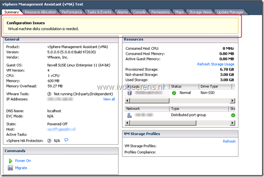
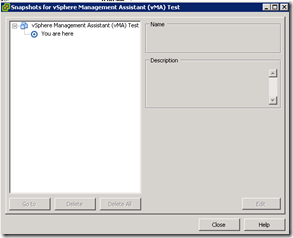
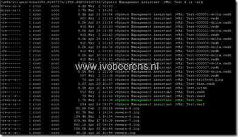
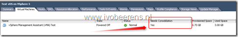
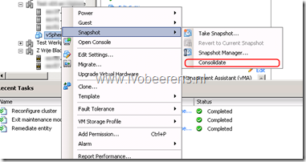
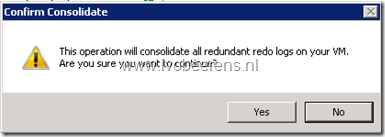
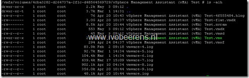

When a snapshot didn’t commit properly, it can happen that the snapshot manager in the vCenter server shows no snapshot(s), but that there are still active delta files on the datastore. These ‘hidden’ snapshot can cause the datastore to run out of space.

To report these ‘hidden’ snapshots (prior vSphere 5), I created a script that searches all the datastores  for ‘\*.delta’ files and reported them by mail.  

In vSphere 5 you have a new feature that reports and make it possible to consolidate these  ‘hidden’ snapshot(s). In vSphere 5 you get  a warning ‘**Virtual machine disks consolidation is needed’** when the virtual machine snapshot consolidation has failed.

The snapshot manager shows no snapshots but there are delta files present on the datastore(s).

<table border="0" cellspacing="0" cellpadding="2" width="400"><tbody><tr><td valign="top" width="200"></td><td valign="top" width="200"></td></tr></tbody></table>

In the vCenter server on the Virtual Machines tab you can enable the field “Needs Consolidation” to filter all the VMs that needs consolidation.

To consolidate the snapshot, right-click the virtual machine and choose **Snapshot** \- **Consolidate**.

Confirm the consolidate

Check the datastore and all the delta files are consolidated

With PowerCLI you can use the following one liner to list all the VMs that needs consolidation (thanks to [Luc Dekens](http://www.lucd.info/) ):

Get-VM | where {$\_.ExtensionData.Runtime.consolidationNeeded} | Select Name 

\[ad#banner\]
