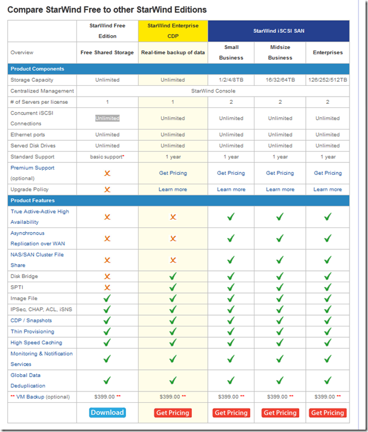

StarWind Offers Free NFR Licenses for Lab Testing, Demonstration, and Training Purposes. The free NFR license keys of StarWind SAN software are available until September 30, 2012. The licenses may be used for non-production purposes only.

A free NFR license is only available for VMware vExperts, VMware Certified Instructors (VCI), Microsoft Most Valuable Professionals (MVP), Microsoft Certified Trainers (MCT), Citrix Technology Professionals (CTP) and Citrix Certified Instructors (CCI).

To receive a free license key, please email to Roman Shovkun, CSO at StarWind ([roman.shovkun@starwindsoftware.com](mailto:roman.shovkun@starwindsoftware.com)) or register at http://www.go.starwindsoftware.com/free-nfr-license.

Here is a comparison between the StarWind editions available:

If you want to build an easy, quick and free iSCSI shared storage  solution for VMware and Hyper-V get your change!
