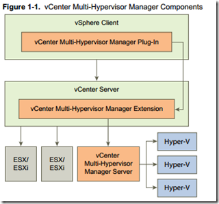
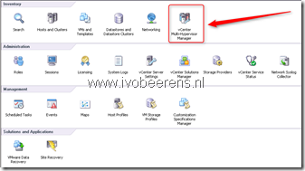
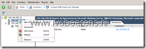
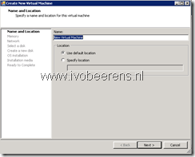
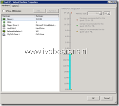
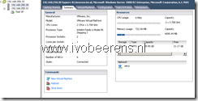

VMware released the first version (1.0) of the vCenter Multi-Hypervisor Manager (MHM). MHM makes it possible to manage multiple heterogeneous hypervisors in VMware vCenter server.

MHM supports only Microsoft Hyper-V Server 2008  and Microsoft Hyper-V Server 2008 R2  as hypervisor! MHM requires vCenter Server 5.1 and can manage 20 Hyper-V hosts with up to 500 VMs running.

As minimum vCenter Server Standard edition is needed. The vCenter Multi-Hypervisor Manager is not available with the vCenter Server Foundation or Essentials edition!

The installation of MHM consist of two components:

- vCenter Multi-Hypervisor Manager Server
- vCenter Multi-Hypervisor Manager Plug-In

After the installation of the plug-In it appears in the inventory tab of the vSphere Client. The MHM Plug-in s not compatible with the vSphere Web Client.

The following tasks can be performed by MHM:

- Third-party host management including add, remove, connect, disconnect and view the host configuration.
- Ability to provision virtual machines on third-party hosts.
- Ability to edit virtual machine settings.
- Integrated vCenter Server authorization mechanism across ESX and third-party hosts inventories for privileges, roles, and users.
- Automatic discovery of pre-existing third-party virtual machines
- Ability to perform power operations with hosts and virtual machines.
- Ability to connect and disconnect DVD, CD-ROM, and floppy drives and images to install operating systems.

<table border="0" cellspacing="0" cellpadding="2" width="400"><tbody><tr><td valign="top" width="200"></td><td valign="top" width="200"></td></tr><tr><td valign="top" width="200"></td><td valign="top" width="200"></td></tr></tbody></table>

### Conclusion

Before MHM VMware released **vCenter XVP Manager and Converter** as Fling in 2011. The fling can be found [here](http://labs.vmware.com/flings/xvp). MHM is not changed that much from vCenter XVP Manager and Converter. MHM  has no support for Microsoft Server 2012 Hyper-V or Hyper-V 3.0  and the tasks that you can perform on Hyper-V are limited.

Some suggestions for the next release:

- Support for Hyper-V 3.0
- Ability to perform a live migration
- Console access to the VM
- Hyper-V to VMware migration (V2V)
- Update integration components

### More information

- VMware vCenter Multi-Hypervisor Manager 1.0  Release Notes. [Link](http://www.vmware.com/support/mhm/doc/vcenter-multi-hypervisor-manager-10-release-notes.html)
- VMware vCenter Multi-Hypervisor Manager Documentation. [Link](http://www.vmware.com/support/pubs/vcenter-multihypervisor-manager-pubs.html)
- VMware vCenter Multi-Hypervisor Manager 1.0 Download [Link](http://www.vmware.com/go/download-vsphere)
- vCenter Multi-Hypervisor Manager FAQ [Link](http://kb.vmware.com/selfservice/microsites/search.do?language=en_US&cmd=displayKC&externalId=2037570)
- Installing vCenter Multi-Hypervisor Manager plug-in best practices [Link](http://kb.vmware.com/selfservice/microsites/search.do?language=en_US&cmd=displayKC&externalId=2039704)
- Installing vCenter Multi-Hypervisor Manager best practices [Link](http://kb.vmware.com/selfservice/documentLinkInt.do?micrositeID=&popup=true&languageId=&externalID=2036700)
