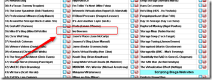

On vSphere-land the yearly voting for the top 50 VMware and virtualization blog(s) is open. 

By voting you can reward the bloggers for their hard work and dedication by letting them know that you appreciate them.

You can vote till March 3 2013, so please take a  minute and vote for your favorite 10 blogs and rank them (if you want to vote for my blog it’s on the left side in the middle). All the blogs are listed on the vLaunchPad page.

If you like my blog or other blogs please take a minute and vote [here.](http://www.surveygizmo.com/s3/1165270/Top-vBlog-2013)

