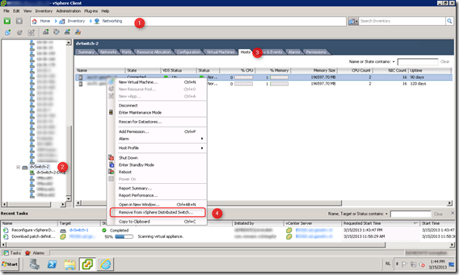

The option to remove a ESXi host from a vSphere Distributed Switch can be difficult to find. Here are the steps listed to remove an ESXi host from a vSphere Distributed Switch (VDS)

- Open the vSphere client
- Click **Home** and the **Networking** icon in the inventory tab
- Select the desired VDS (2)
- Select the hosts tab
- Select the desired ESXi host, right click and select **Remove from vSphere Distributed Switch** (4)

