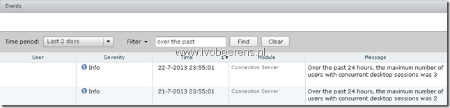
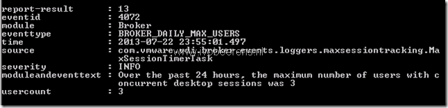
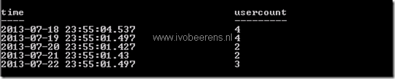

VMware Horizon View generates everyday at 5 minutes  for midnight an event how many concurrent users connected to View that day. This information can be useful for example when when investing trends.

When the Event database in the VMware Horizon View Administrator is configured, this information can be found using the VMware Horizon View Administrator, Monitoring, select Events and filter for “over the past”

With PowerCLI the daily maximum concurrent connected users can be displayed by using  the following command from the VMware View Connection server using View PowerCLI:

Get-EventReport -viewName user\_count\_events

The following command displays the concurrent users from the last 5 days:

Get-EventReport -viewName user\_count\_events -startDate ((Get-Date).AddDays(-5)) | sort time | Select Time,Usercount

You can customize the command further for your needs.
