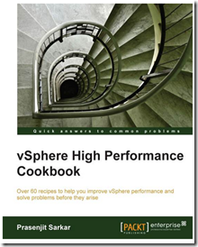

vSphere High Performance Cookbook offers a comprehensive understanding of the different components of vSphere and the interaction of these components with the physical layer which includes the CPU, memory, network, and storage. If you want to improve or troubleshoot vSphere performance then this book is for you!

The book is written by Prasenjit Sarkar (@stretchcloud). Prasenjit Sarkar is a senior member of the Technical Staff in VMware Service Provider Cloud R&D, where he provides architectural oversight and technical guidance to design, implement, and test VMware's Cloud datacenters.

Table of Contents

- Preface
- Chapter 1: CPU Performance Design
- Chapter 2: Memory Performance Design
- Chapter 3: Networking Performance Design
- Chapter 4: DRS, SDRS, and Resource Control Design
- Chapter 5: vSphere Cluster Design
- Chapter 6: Storage Performance Design
- Chapter 7: Designing vCenter and vCenter Database for Best Performance
- Chapter 8: Virtual Machine and Application Performance Design

A sample chapter can be downloaded here. It contains 240 pages and is available as paperback and eBook. More information about the book can de found [here](http://bit.ly/14sDuyk).
