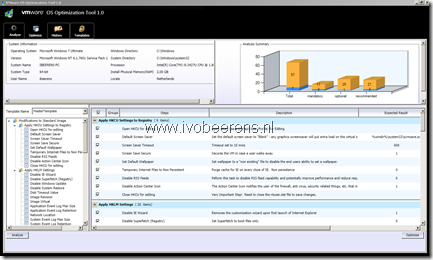

VMware Labs has released a new cool fling called “VMware OS Optimization Tool”. This tools helps to optimize Windows 7 desktops for the use of VMware Horizon View.

VMware OS Optimization Tool can analyze a local or remote Windows 7 template and apply the VMware best practices to optimize the template on the following components:

- VMware components
- Registry settings
- Disable Services
- Disable Features
- Disable Scheduled Tasks

With this tool optimizing  a Windows 7 templates is very easy. More information can be found on the VMware Labs Fling webiste found [here](http://labs.vmware.com/flings/vmware-os-optimization-tool).
