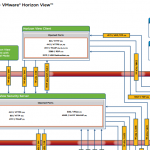

VMware has released a Network Port Diagram diagram for VMware Horizon View 5.2.

This diagram covers an entire VMware View environment with protocols and port numbers used. In earlier blog posts I already create two small diagrams with protocols and port numbers used by VMware View:

- Tips for implementing a VMware Horizon View Security Server. [Link](https://www.ivobeerens.nl/2013/03/05/tips-for-implementing-a-vmware-horizon-view-security-server/)
- VMware Horizon View and HTML access (Blast protocol). [Link](https://www.ivobeerens.nl/2013/03/20/vmware-horizon-view-and-html-access-blast-protocol/)

The  diagram created by VMware can be handy when implementing and troubleshooting VMware Horizon View. Download the diagram here [Link](http://kb.vmware.com/selfservice/microsites/search.do?language=en_US&cmd=displayKC&externalId=2061913)
