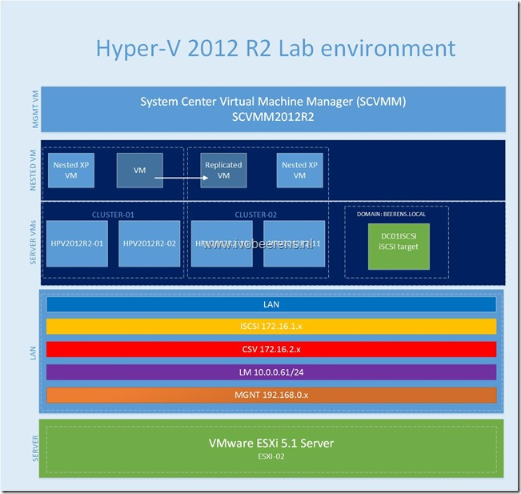

On the moment I’m preparing for the 74-409 Server Virtualization with Windows Server Hyper-V and System Center  exam. The exam is an replacement for the  Windows Server 2008 R2 Server Virtualization 70-659 exam.  To prepare for the 74-409 exam I use the following resources:

- Exam information: 74-409: Server Virtualization with Windows Server Hyper-V and System Center Associated. Link
- Microsoft Virtual Academy (MVA) Server Virtualization with Windows Server Hyper-V and System Center free training. [Link](http://www.microsoftvirtualacademy.com/training-courses/server-virtualization-with-windows-server-hyper-v-and-system-center#?fbid=yM4f8z6IZ3H)
- 74-409 Study WIKI. [Link.](http://borntolearn.mslearn.net/certification/server/w/wiki/614.409-server-virtualization-with-windows-server-hyper-v-and-system-center.aspx#fbid=YUXxfCVliqX)
- Claim a free voucher for the 74-409 exam. Link
- Bjorn Houben preparing links for the 74-409 exam. [Link](http://bjornhouben.wordpress.com/2013/12/19/microsoft-preparing-for-free-exam-74-409-server-virtualization-with-windows-server-hyper-v-and-system-center/)
- Lab environment for Hands-on experience

The most important piece is to get hands-on experience. To get hands-on I build a Hyper-V 2012 R2 lab environment. The lab environment is build on a single whitebox ESXi server. The lab environment contains the following components:

- VMware ESXi server with an Intel-i7-3820 CPU,32 GB memory and 1TB local storage. [Link](https://www.ivobeerens.nl/2012/03/13/intel-x79-whitebox-for-vsphere-5-and-hyper-v-3/)
- HP ProCurve  1018G-8 port switch.
- 4 x Windows Server 2012 VMs with the Hyper-V role enabled. The 4 Hyper-V VMs are divided over two clusters. Each cluster runs 2 VMs (nested).
- 1 x Windows Server 2012 R2 Domain Controller with iSCSI target enabled. The nested VM’s inside the Hyper-V VMs are stored on the iSCSI target.
- System Center Virtual Machine Manager 2012 R2 VM for the management of both Hyper-V clusters

Here is an overview of the Hyper-V 2012 R2 lab environment:

