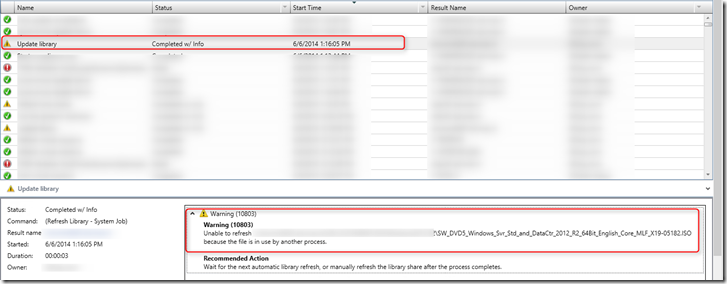
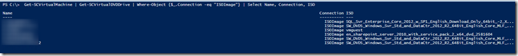
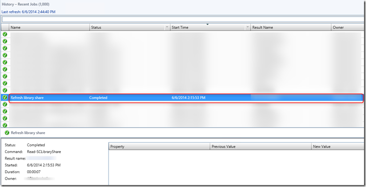

In the jobs window in the System Center Virtual Machine Manager (SCVMM) console , the following warning appeared:

<table cellspacing="0" cellpadding="2" width="744" border="0"><tbody><tr><td valign="top" width="742">
Warning (10803) Unable to refresh <a href="file://\\server\share\ISO\Windows2012&nbsp;R2\SW_DVD5_Windows_Svr_Std_and_DataCtr_2012_R2_64Bit_English_Core_MLF_X19-05182.ISO">\\server\share\ISO\Windows2012</a> R2\SW_DVD5_Windows_Svr_Std_and_DataCtr_2012_R2_64Bit_English_Core_MLF_X19-05182.ISO because the file is in use by another process.

Recommended Action Wait for the next automatic library refresh, or manually refresh the library share after the process completes.

</td></tr></tbody></table>

The warning means that the ISO file is in use by one or more VM’s. To find the VM’s that are using the ISO file I created the following PowerShell script:

Import-module VirtualMachineManager
Get-SCVMMServer -ComputerName VMMSERVER
Get-SCVirtualMachine | Get-SCVirtualDVDDrive | Where-Object {$\_.Connection -eq "ISOImage"} | Select Name, Connection, ISO

The script displays all the VMs that have an ISO file attached. The script is tested against a SCVMM 2012 R2 server.

After changing the VMs Virtual DVD drive to “No media” the hourly (default) refresh of the library went without a warning.

