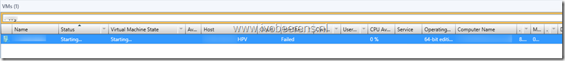

During a migration of a VM from a different cluster the job failed in SCVMM.

The status of the VM in SCVMM Virtual Machine State is still “Starting”. 

In SCVMM I was unable to stop, repair or delete the VM. When looking on the Hyper-V host, the VM didn’t exist in Failover Cluster Manager or Hyper-V manager. After some troubleshooting I was able to use the following PowerShell command to remove the orphaned VM in SCVMM:

Import-Module VirtualMachineManager

Get-VM -VMMServer **VMMSERVER** –Name “**VMNAME**" | Remove-VM -Force

Replace the **VMMSERVER** and **VMName**  in the PowerShell syntax with your own names
