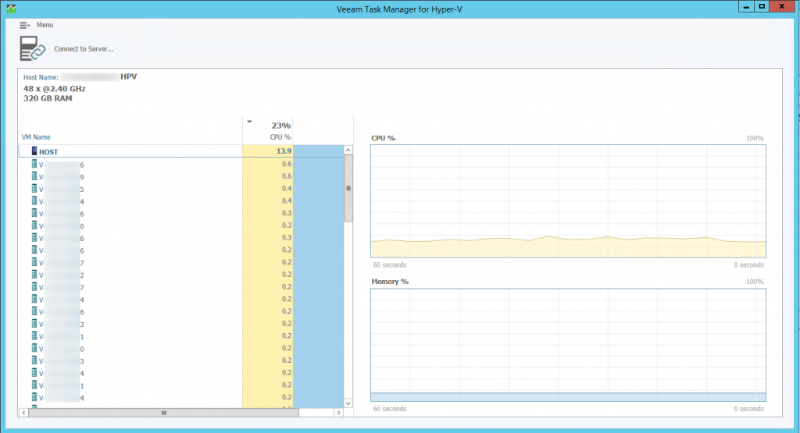

Task Manager for Hyper-V 1.0 is a new free tool from Veeam. Task Manager can connect to a individual Hyper-V hosts and display information about the host and the guest VMs. Real time CPU and memory utilization is displayed.  This can be useful when monitoring or troubleshoot Hyper-V server utilization. Task Manager for Hyper-V requires no installation and is free of charge.

 

 

 

 

 

 

More information about Veeam Task Manager can be found [here](http://hyperv.veeam.com/free-task-manager-hyper-v-performance-monitoring/)
