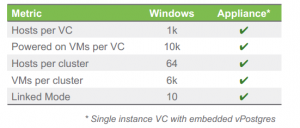
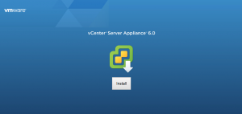
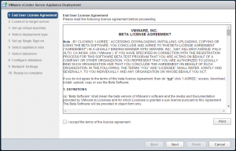
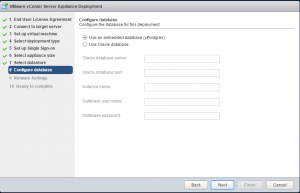
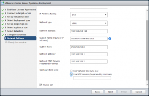
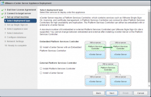
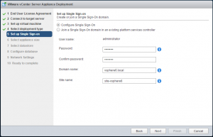
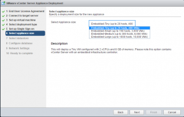
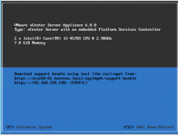

What's new in the vCenter Server Appliance (vCSA) 6.0:

- ISO with an easy guided Installer
- Different deployment options possible during the guided installer such as:
    - Install vCenter Server
    - Install Platform Services Controller
    - Install vCenter Server with an Embedded Platform Controller (default)
- Scripted install. Values can be specified in a template file
- Embedded vPostgres database. As external database Oracle is supported.
- IPv6 Support
- Enhanced Linked mode support
- VMware Data Protection (VDP) support for backup and recovery
- Based on a hardened Suse Linux Enterprise 11 SP3 (64-bit)
- The minimum (Up to 20 hosts and 400 VMs) appliance requirements for the VCSA are:
    - 2 vCPU
    - 8 GB memory
    - ~ 100 GB diskspace
- Is has the same feature parity as vCenter Windows:

What are we missing:

- Still no Microsoft SQL database support.
- Possibility to separate roles of the vCenter
- VMware Update Manager is not included in the appliance. Still need an additional Windows Server for VMware Update Manager (VUM)
- Clustering of the vCenter Server Appliance

 

       
