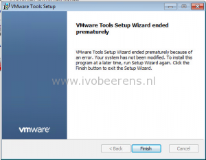

After upgrading all the hosts in the lab environment to VMware ESXi 6, I tried to upgrade the VMware tools version of a Dutch Windows 7 golden VM used by VMware Horizon View. The VMware tools upgrade fails with the following message:

> VMware Tools Setup Wizard ended prematurely

This is a known bug in VMware ESXi 6.0 with Dutch Operating System VMs (see KB, [link](http://kb.vmware.com/selfservice/microsites/search.do?language=en_US&cmd=displayKC&externalId=2114476)).

The following work around can be used:

- Create a local group named "everyone"
- Add the user used for installing VMware tools to the "everyone" group
- Run the VMware tools upgrade
- Remove the "everyone" group
