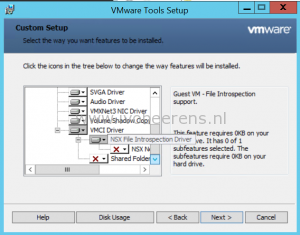
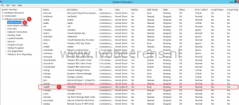

The vShield Endpoint drivers are renamed as Guest Introspection Drivers. In VMware Tools there are two drivers available:

- NSX File Introspection Driver (**vsepflt.sys**)
- NSX Network Introspection Driver (**vnetflt.sys**)

These drivers can be installed separately now and allows you to install the file driver without installing the network driver. To install the vShield Endpoint Thin Agent driver (vsepflt.sys), select the NSX File Introspection Driver in VMware tools under VMCI Driver.

For existing installations check if the vShield Endpoint Thin Agent driver is installed by using the following steps:

- Open 'msinfo32'
- Select Software Environment (1)
- Select System Drivers (2)
- Search for the vsepflt driver (3) and check if the driver is running

