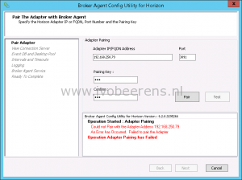
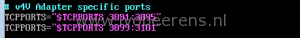
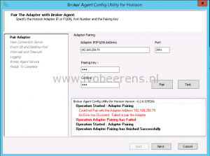

When trying to pair the Broker agent 6.2 with the Horizon adapter in vRealize Operations Manager (vROps), it fails with the following error:

> Could not Pair with Adapter Address .... An Error has Occurred. Failed to pair the Adapter. Operation Adapter Pairing Failed.

This issue occurs when the firewall rules on the vRealize Operations Manager are incorrect. To resolve this issue update the firewall rules using the following steps:

- Open the VM console of the vRealize Operations Appliance or enable SSH (l[ink](https://www.ivobeerens.nl/2015/12/08/4105/))
- Log in as root user/
- Open the "/opt/vmware/etc/vmware-vcops-firewall.conf" file in vi
- Make sure the following entries are added to the V4V Adapter specific ports section

\# v4V Adapter specific ports TCPPORTS="$TCPPORTS 3091:3095" TCPPORTS="$TCPPORTS 3099:3101"

- Save the file
- Restart the firewall by using the following command:

/etc/init.d/vmware-vcops-firewall restart

Try to pair the adapter again. The pairing must now be successful.

