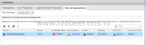

In my lab environment I had problems with the Guest Introspection service. The installation was failed. Trying to remove the Guest Introspection service failed every time in the Service Deployments tab.

After performing the following steps, I was able to remove the Guest Introspection service :

- Put the ESXi host in maintenance mode
- Drag the ESXi host outside the cluster
- Drag the ESXi host back to the cluster
- Reboot the host
- Exit maintenance mode
- Click on resolve in the Service Deployments section

After performing these steps the Guest Introspection service is removed from the host.
