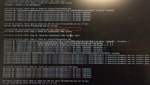

In the vSphere Web client an orphaned  vSAN object was listed named:

\[code language="text"\] /vmfs/volume/vsanuuid \[/code\]

From the vSphere Web Client you cannot manage orphaned vSAN objects . To check and fix orphaned vSAN objects, the Ruby vSphere Console (RVC) is needed.  The 'vsan.check\_state' command checks if VMs and Virtual SAN objects are valid and accessible.

After logging in the RVC (rvc administrator@vsphere.local@localhost), execute the "vsan.check\_state -r" command at the cluster level:

\[code language="text"\] /localhost/dc-beerens-01/computers/CL-01/vsan.check\_state -r \[/code\]

The "-r" parameter refreshes the VMX and registers the VMs.

After running the "vsan.check\_state -r" command, the vSAN object is listed as VM back again in the vSphere Web Client.
