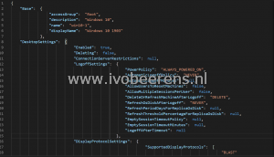

I created a simple PowerShell script that exports all the pool settings on a Horizon Connection Server and saves them in a separate JSON file. To run this script follow the requirements below:

- Download the Export-pools.ps1 script from my [GitHub](https://github.com/ibeerens/VMware-Horizon) page.
- Edit the script script and enter the correct file location in the '$fileloc' variable. The default file location is c:\\temp
- Download the VMware.Hv.Helper module ([link](https://github.com/vmware/PowerCLI-Example-Scripts))
- Copy the VMware.Hv.Helper module to the module location. Use the '$env:PSModulePath' PowerShell command to list the module path(s)
- Run the 'Export-HorPool.ps1' script in PowerShell

After the 'Export-HorPool.ps1' scrript has run all the pool settings are exported to a JSON file.

