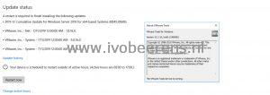

Today I was updating a Windows Server 2016 template VM with Windows Updates. During the update, I notice that the pvscsi and vmxnet3 drivers are updated by the Windows Updates process.

In 10.3.10 of VMware Tools, the pvscsi and vmxnet3 drivers available through Windows Update for Windows Server 2016 and Windows Server 2019 Operating Systems. This means that the pvscsi and vmxnet3 drivers are updated as part of the Windows Updating process. This reduces the number of reboots needed.

So make sure that all the Windows Server 2016 and 2019 VMs have at least version 10.3.10 (or higher) of the VMware Tools installed to reduce the number of reboots.
