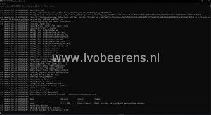
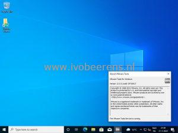

Most of the time I use Packer against a VMware vSphere and Microsoft Azure environment. But sometimes it's useful to use VMware Workstation for local testing purposes. For building Windows 10 images with Packer and using VMware Workstation there is not much information available. In this blog post, I show how to build a Windows 10 image with Packer and VMware Workstation.

With Packer, the vmware-iso builder is used for creating images with VMware Workstation/Fusion.  In this example I create a Windows 10 image with the latest VMware Tools installed, the installation of the Evergreen module, and automatically install the latest Windows updates.

## **Pre-requisites**

- Windows a 10 ISO file. You can use this [link](https://www.ivobeerens.nl/2021/05/19/quick-tip-download-the-latest-windows-10-iso-file/) for downloading the latest Windows 10 ISO for example
- Install VMware Workstation. I use VMware Workstation Pro 16.x
- The newly created image must be able to access the internet for  downloading the latest VMware Tools version
- During my first deployment, the following build issue occurred Build "**Could not determine network mappings from files in the path: C:/Program Files (x86)/VMware/VMware Workstation**". Colin Westwater of vGemba.net has blogged about a solution that can be found here, [link](https://www.vgemba.net/vmware/Packer-Workstation-Error/).
- Use NAT in VMware Workstation.

## **Steps**

- Run the following PowerShell script ([link](https://raw.githubusercontent.com/ibeerens/Packer/main/workstation/windows10/download.ps1)). This script does the following things:
    - Create a download folder such as c:\\Packer (line 6-17)
    - Download the latest Packer version and unzip the package (line 19-30)
    - Download my Github Packer repository to the local download folder (line 35-39)
    - Create within the download folder the Packer folder structure (line 41-45)

\[code language="powershell"\] # $ErrorActionPreference = "SilentlyContinue" # Enable TLS 1.2 \[Net.ServicePointManager\]::SecurityProtocol = \[Net.SecurityProtocolType\]::Tls12

\# Variables $downloadfolder = 'C:\\packer\\' $github = 'https://github.com/ibeerens/Packer/archive/refs/heads/main.zip'

\# Create Folder $checkdir = Test-Path -Path $downloadfolder if ($checkdir -eq $false){ Write-Verbose "Creating '$downloadfolder' folder" New-Item -Path $downloadfolder -ItemType Directory | Out-Null } else { Write-Verbose "Folder '$downloadfolder' already exists." }

\# Download the latest Packer version $product='packer' $packurl = Invoke-WebRequest -Uri https://www.$product.io/downloads.html | Select-Object -Expand links | Where-Object href -match "//releases\\.hashicorp\\.com/$product/\\d.\*/$product\_.\*\_windows\_amd64\\.zip$" | Select-Object -Expand href $packdown = $packurl | Split-Path -Leaf $packdownload = $downloadfolder + $packdown $webclient = New-object -TypeName System.Net.WebClient $webclient.DownloadFile($packurl, $packdownload)

\# Unzip Packer Expand-Archive $packdownload -DestinationPath $downloadfolder # Remove the Packer ZIP file Remove-Item $packdownload

\# Go to the Packer download folder Set-Location $downloadfolder

\# Download Github files Invoke-WebRequest -Uri $github -OutFile ${downloadfolder}packer.zip Expand-Archive ${downloadfolder}packer.zip -DestinationPath $downloadfolder # Remove the packer.zip Remove-Item -Path ${downloadfolder}packer.zip

\# Create the folder structure Move-Item ${downloadfolder}Packer-main\\workstation\\windows10\\setup -Destination $downloadfolder Move-Item ${downloadfolder}Packer-main\\workstation\\windows10\\\*.\* -Destination $downloadfolder # Remove the Github structure Remove-Item -Path ${downloadfolder}Packer-main -Recurse -Confirm:$false -Force \[/code\]

- Browse to the download folder
- Open the "win10-std-.auto-pkvars.hcl" file and edit the variables for your needs such as:
    - Line 2: The VM name
    - Line 17: The ISO location
    - Line 19: The ISO checksum. Use the PowerShell Get-Filehash command to get the checksum of the ISO

\[code language="text"\] // VM vm\_name = "GI-W10-001" operating\_system\_vm = "windows9-64" vm\_firmware = "bios" vm\_cdrom\_type = "ide" vm\_cpus = "2" vm\_cores = "1" vm\_memory = "2048" vm\_disk\_controller\_type = "nvme" vm\_disk\_size = "32768" vm\_network\_adapter\_type = "e1000e" // Use the NAT Network vm\_network = "VMnet8" vm\_hardwareversion = "19"

// Removeable media win10\_iso = "c:/iso/en-us\_windows\_10\_business\_editions\_version\_21h2\_x64\_dvd\_ce067768.iso" // In Powershell use the "get-filehash" command to find the checksum of the ISO win10\_iso\_checksum = "1323FD1EF0CBFD4BF23FA56A6538FF69DD410AD49969983FEE3DF936A6C811C5" \[/code\]

- Open the "autounattend.xml" file in the setup folder and check and edit the following lines as needed:
    - Language and keyboard settings
        
    - Line 84: Administrator Password (must be the same as the winrm\_password)
    - Line 92: Autologon Password (must be the same as the winrm\_password)
    - Line 141: The ComputerName

- Edit the build.ps1 file and check the following lines:
    - Line 2: Packer folder location
    - Line 14: The winrm\_password matches the administrator password in the autounattended.xml file

\[code language="powershell"\] # Variables $downloadfolder = 'C:\\packer\\'

\# Go to the Packer download folder Set-Location $downloadfolder

\# Show Packer Version .\\packer.exe -v

\# Download Packer plugins .\\packer.exe init "${downloadfolder}windows.json.pkr.hcl"

\# Packer build .\\packer.exe build -force -var-file="${downloadfolder}win10-std.auto.pkrvars.hcl" -var "winrm\_username=administrator" -var "winrm\_password=ThisisagoodPassword!" "${downloadfolder}windows.json.pkr.hcl" \[/code\]

- Execute the "build.ps1" file with PowerShell to start the Packer image build process.

- After a while, the build process finishes and you have a new Windows 10 image deployed with Packer in VMware Workstation.

