I see a lot of environments where the Virtual Machine (VM) disk space must be extended.

Prior ESX 3.5 the way to extend a VDMK was to use the vmkfstools command with the -X parameter from the VMware ESX server console. With the coming of ESX 3.5 it is possible to extend the VMDK file when the VM was shutdown. Now  with VMware ESX 3.5 Update 2 it is possible to online (hot) extend the VMDK file.

In the Virtual Infrastructure Client (VIC) go to the VM and edit the settings, click on the disk there is a property New Size (figure 1).

[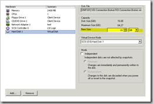](https://www.ivobeerens.nl/wp-content/uploads/2008/08/image.png)

Figure 1. The VM disk extend function

The first step is to see if there is enough free space on the LUN (datastore). You can check the disk space (realtime) by using the command vdf -h on the ESX server console or in a SSH session. Keep in mind to have a average of 10% free on the LUN for snapshots and swap files etc. 

If the disk space on the LUN is okay you can extend the disk. In this example we extend the 16GB disk to 20GB.

[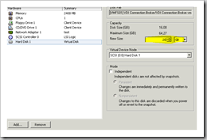](https://www.ivobeerens.nl/wp-content/uploads/2008/08/image1.png)

Figure 2. The VM disk extend function

When the VMDK is extended the disk space must be added to the Windows volume.  In the Windows Disk manager when using VMware ESX 3.5 Update 2,  use the "Rescan Disks" function to discover the new added space when you use the hot extend function. The new added space is seen as Unallocated

[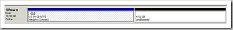](https://www.ivobeerens.nl/wp-content/uploads/2008/08/image2.png)

Figure 3. Windows disk manager

To extend the volume by using diskpart use the following commands:

- Start - run - type diskpart
- type list volume
- type select volume 1
- type extend When trying to extend the C partition with diskpart you got the following message "The volume you have selected may not be extended"
    
    [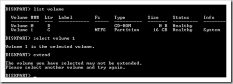](https://www.ivobeerens.nl/wp-content/uploads/2008/08/image3.png)
    
    Figure 4. Diskpart tool
    
    It is not possible to extend the system- and bootvolume by using the diskpart built-in command (for MS Vista, Windows 7 and Windows 2008 and higher you can extend the volume by using diskpart). For MS Windows XP and MS Windows 2003 there are other options you can use:
- Add the system- and bootdisk volume to the other Virtuele Machine (VM) as disk.  Start the other VM and use the diskpart command to extend this disk or use an 3e party partition tool.
- Use the command line tool from Dell called [Extpart](http://support.dell.com/support/downloads/download.aspx?c=us&cs=19&l=en&s=dhs&releaseid=R64398&formatcnt=2&fileid=83929). Usage:  expart \[drive\] \[sizetoextend\] 
- Use the Gparted tool. You can download the ISO file from [here](http://gparted.sourceforge.net/). When the download completes upload the ISO file to your storage and attach and connect the ISO the to the VM.
- 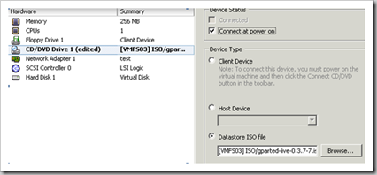
    
    Figure 5. Connect the ISO file to the VM
    
    Start the VM, the ISO gets started
    
    [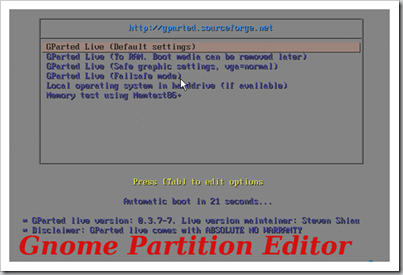](https://www.ivobeerens.nl/wp-content/uploads/2008/08/image5.png)
    
    Figure 6. Start the Gparted tool
    
    \- Press Enter
    
    [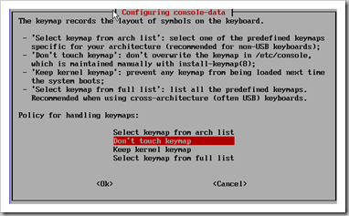](https://www.ivobeerens.nl/wp-content/uploads/2008/08/image6.png)
    
    Figure 7. Keymap choice
    
    \- Press OK
    
    [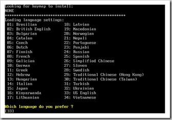](https://www.ivobeerens.nl/wp-content/uploads/2008/08/image7.png)
    
    Figure 8. Keyboard layout
    
    \- Select your keyboard layout
    
    [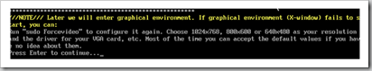](https://www.ivobeerens.nl/wp-content/uploads/2008/08/image8.png)
    
    Figure 10. X-windows graphical warning
    
    \- Press Enter
    
    [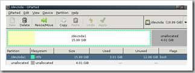](https://www.ivobeerens.nl/wp-content/uploads/2008/08/image9.png)
    
    Figure 11. GParted Parition tool
    
    \- The partition layout is displayed. Select the disk the extend and press Resize/Move
    
    [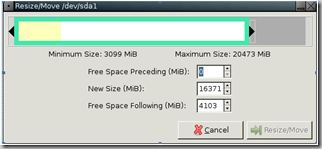](https://www.ivobeerens.nl/wp-content/uploads/2008/08/image10.png)
    
    Figure 12. Partition resize window
    
    \- Enter the new size or drag the bar the the right and press the Resize/ Move button
    
    [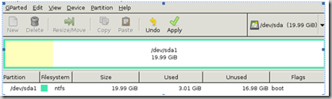](https://www.ivobeerens.nl/wp-content/uploads/2008/08/image11.png)
    
    Figure 13. Partition resize
    
    \- Click the Apply button
    
    [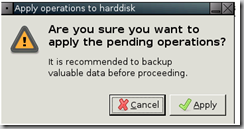](https://www.ivobeerens.nl/wp-content/uploads/2008/08/image12.png)
    
    Figure 14. Partition resize warning
    
    \- Press Apply
    
    [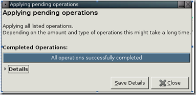](https://www.ivobeerens.nl/wp-content/uploads/2008/08/image13.png)ur
    
    Figure 15. Partition resize process
    
    \- If the extending process completes and is successfully, restart the system and disconnect the ISO from the VM and restart the VM.
    
    [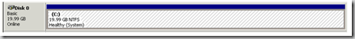](https://www.ivobeerens.nl/wp-content/uploads/2008/08/image14.png)
    
    Figure 16. Windows Disk Manager
    
    \- After the restart open the Windows disk manager and you see the new space is added to the volume.
