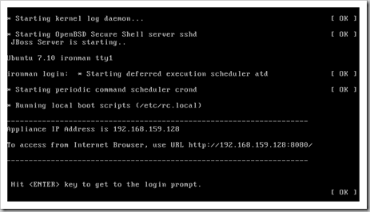
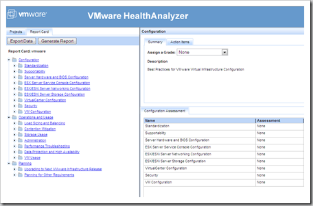
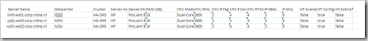
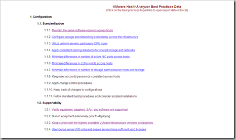

VMware has released version 1.0 of VMware HealthAnalyzer. VMware HealthAnalyzer is an virtual appliance that collects and analyses the VMware configuration and analyses categorized by VMware Health check best practices.  This tool can be uses by VMware consultants and VMware Authorized Consultant (VAC) partners.

The data can be exported to HTML and Microsoft Excel.

Some screenshots from VMware HealthAnalyzer:

The VMware HealthAnalyzer Appliance started

Report created

ESX hardware exported to Microsoft Excel.

Complete report exported to HTML.

I had problems using the VMware HealthAnalyzer on VMware VC 2.5 Update 2. When i try to Create a new Report Card i've got the following message:

Dataset for the report card is not valid. Dataset id=12 ; Datset File Name=/usr/share/ironman/capture/captureFiles/c20080817230624

VMware has confirmed there is a known issue, VMware HealthAnalyzer is not able to parse the version of the SDK correctly and released a fix. The are coming soon with a new version.
