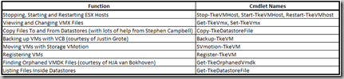
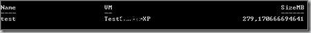

Today I tested the VI Toolkit extensions.  The VI Toolkit extensions are cmdlets that makes your life easier. Here are some functions of what the cmdlets can do:

The VI toolkit extensions require PowerShell V2 CTP 2 and the VI Toolkit. The VI toolkit extension can be downloaded @ [http://www.codeplex.com/vitoolkitextensions](http://www.codeplex.com/vitoolkitextensions)

Example:

**list all VMs by name and list the size of the snapshots**

\- Open VI-toolkit

\- Connect-VIserver VCservername

\- To add the extension, use the following command:

> Add-Module "D:\\Scripts\\viToolkitExtensions.psm1"

> Get-VM | Get-TkeSnapshotExtended | select Name, VM, SizeMB

Output:

