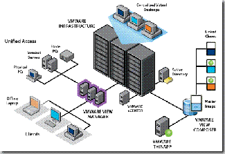

VMware has VMware View released. The solution consist of:
- VMware Virtual Desktop Infrastructure (VMware Infrastructure 3 + VMware View Manager 3)
- Storage Optimization with VMware View Composer
- Application Virtualization with VMware ThinApp
- Client Virtualization with Offline Desktop – Experimental Use

**VMware infrastructure 3:**

VMware View 3 is built on VMware Infrastructure 3 and as a result, IT organizations can extend the benefits of industry-leading virtualization to the desktop. Integrating desktop infrastructure with VMware Infrastructure 3 provides unified management and a host of features that improve performance, reliability and business continuity, including:

- Ability to group servers, which host virtual desktops, together for redundancy and eliminate single point of failure.
- Consolidated Backup centralizes backup for desktop virtual machines.
- Automated failover and recovery to keep desktops running nonstop.
- Dynamic load balancing for desktop computing resources

**View Manger:**

View Manager 3, a key component of VMware View, is an enterprise class desktop management solution, which streamlines the management, provisioning and deployment of virtual desktops. Users securely and easily access virtual desktops hosted on VMware Infrastructure 3, Terminal Servers, Blade PCs or even remote physical PCs through View Manager. Virtual desktop upgrading and patching are done centrally from a single console so you can efficiently manage hundreds or even thousands of desktops—saving time and resources.

**VMware View Composer:**

A new component of the VMware View solution, View Composer uses VMware Linked Clone technology to rapidly create desktop images that share virtual disks with a master image to conserve disk space and streamline management. User data and settings are separated from the desktop image, so they can be administered independently. All desktops that are linked to a master image can be patched or updated simply by updating the master image, without affecting users’ settings, data or applications. This reduces storage needs and costs by up to 70% while simplifying desktop management.

**VMware ThinApp:**

VMware ThinApp application virtualization software decouples applications from operating systems and packages them into an isolated and encapsulated file. This allows you to run multiple versions of applications on a single desktop without conflict, or the same version of an application on multiple operating systems without modification. Reduce storage needs for virtual desktops and simplify application management by streaming applications packaged with ThinApp from a centralized server or a shared network drive.

**Offline Desktop – Experimental Use:**

Offline Desktop for experimental use allows complete virtual desktops to be moved between the datacenter and physical desktop devices with security policies intact. Changes to the virtual desktop are intelligently synchronized between datacenter and physical desktop device. Offline Desktop allows an end user to access their virtual desktop while not connected to the network or simply take advantage of a physical desktop devices local resources to run their virtual desktop for an enhanced end user experience

