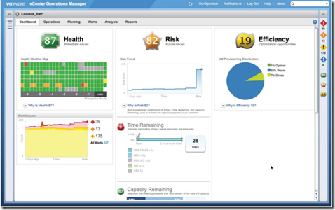

Here is a list of vCOPS resources available:

- vCenter Operations Management edition – [Comparison](http://www.VMware.com/products/datacenter-virtualization/vcenter-operations-management/compare-editions.html)
- VMware vCenter Operations 5.0 - [Introduction](http://www.youtube.com/watch?v=Z-DJuTiqKag)
- VMware vCenter Operations Manager 5.0 - [Install and Configure](http://www.youtube.com/watch?v=pwRdGDhI0lc)
- VMware vCenter Operations Manager – [Fundamentals](http://mylearn.VMware.com/mgrreg/courses.cfm?ui=www_edu&a=det&id_course=132265)
- VMware vCenter Operations Manager – [Documentation](http://www.VMware.com/support/pubs/vcops-pubs.html)
- VMware vCenter Operations Manager – [Level 300 technical training](http://communities.VMware.com/docs/DOC-18592)

