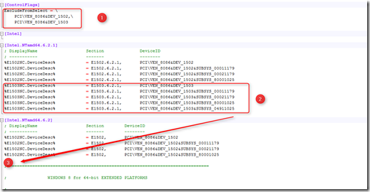
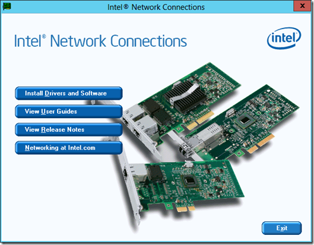
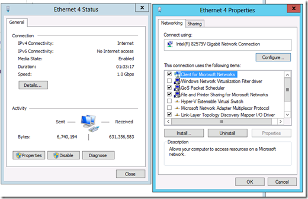

Here are the steps:

- To be able to modify the drivers you need to run the the following commands:

bcdedit -set loadoptions DISABLE\_INTEGRITY\_CHECKS 
bcdedit -set TESTSIGNING ON 

  

- Reboot

- Download the Intel drivers. In my case I used the Intel drivers Asus has available for the Asus P9X79 motherboard

- Save them to a map and extract them if needed

- Open the folder **PRO1000**

- Open the folder **Winx64**

- Open the folder **NDIS63**

- Open the **e1c63x64.inf** file, I used Notepad++  to edit the file

- In the \[**ControlFlags**\] section delete the 3 lines (1)

- Select and copy the five **%E1503 lines** (2)

- Paste the 5 lines in the **\[Intel.NTamd64.6.2\]** section below the %1502NC lines

- After the modifications the **e1c63x64.inf** file must look like this:

- Save the file

- Install the Intel drivers

- After the installation the Intel 82579V Gigabit NIC is recognized and enabled

- Enable the driver integrity checks and disable test signing again by using the following commands:

bcdedit -set loadoptions ENABLE\_INTEGRITY\_CHECKS
bcdedit -set TESTSIGNING OFF

- Reboot

Now you can use the Intel 82579V Gigabit NIC  in Windows Server 2012.

