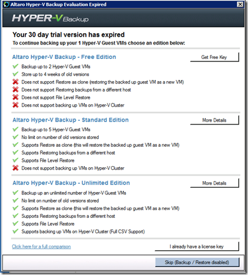
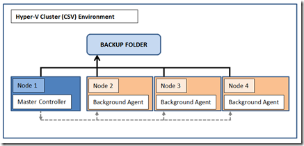
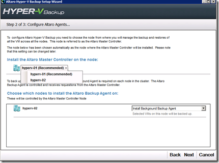
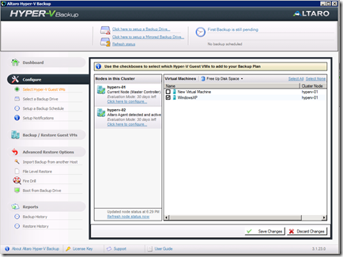
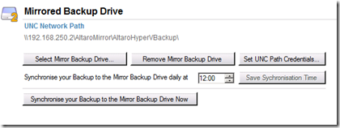
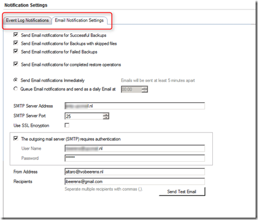
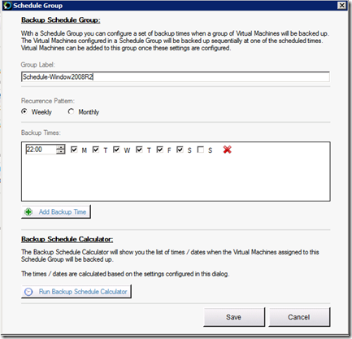
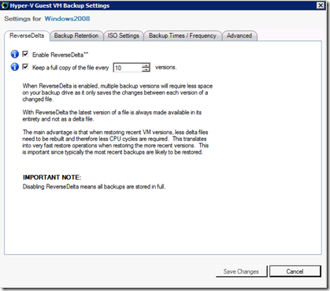
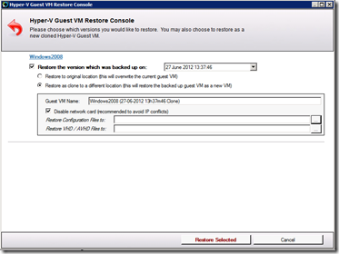
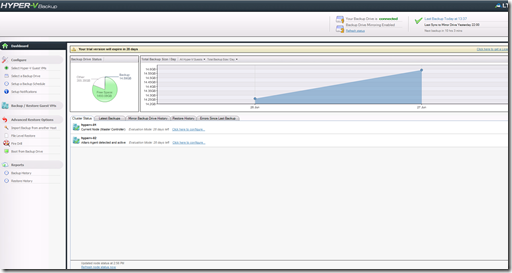

In my LAB environment I tested Altaro Hyper-V Backup version 3. Altaro Hyper-V Backup is software that makes it possible to backup and restore Windows 2008 (R2) Hyper-V VMs.

### Editions

There are three editions available: The free edition, the standard edition and the unlimited edition. For this test I used the unlimited edition because it supports “Cluster Shared Volumes (CSVs)”.  More info can be found here.

### Installation

Altaro Hyper-V Backup needs to be installed on the Hyper-V host. In a Hyper-V Cluster environment, the cluster node were Altaro Hyper-V Backup is installed,  is called the Master Controller. On all the other nodes agents are installed. The Master Controller node configures and controls all the Altaro Background Agents on the cluster.

On the node you  that will become the Master Controller launch the downloaded 14 MB installation file. Within a minute the installation is competed.

### Configuration

The configuration is a couple of steps:

1\. Select the Master Controller Node and install the “background backup agents” to the other cluster node(s).

2\. Select the Hyper-V VMs to backup

3\. Select a Backup Drive. The following backup drives are supported:

> USB External Drives  
> eSata External Drives  
> USB Flash Drives  
> Fileserver Network Shares using UNC Paths  
> NAS devices (Network Attached Storage) using UNC Paths  
> PC Internal Hard Drives (recommended only for evaluation purposes)  
> RDX Cartridges

It supports multiple backup drive swapping and  It is possible to mirror the backup data to another location by creating a mirror schedule..

4\. Setup the notifications.

Notifications can be set by Event Log and/or Email. 

5\. Create a backup schedule and place the VMs in the schedule group.

After these 5 steps the backup schedule is ready.

### Backup

Altaro used the ReverseDelta technology. ReverseDelta only save the changes between each version of a changed file, rather than backing up the whole file every time it changes. The latest version of a file is always made available in its entirety and not as a delta file.  More information about the ReverseDelta can be found [here](http://www.altaro.com/files/AltaroBackupReverseDelta.pdf).

When Altaro initiates a backup from the Hyper-V Host it invokes a VSS on the Hyper-V server (software VSS) and then it invokes a VSS within the Virtual Machines - this last step is done automatically by the MS Hyper-V VSS Writer. This means that as long as the VSS within the VM succeeds then any VSS applications (for example Microsoft SQL or Exchange) within the VM will commit their data to disk resulting in a proper application-consistent backup. When Altaro makes a backup from a VM on a Cluster Shared Volume (CSV) the the volume is in redirected mode during the whole backup! This is common CSV behavior when using software VSS.

To shorten the time the volume is in redirected mode it is possible to use a hardware VSS provider (SAN must support a hardware VSS provider). To enable hardware VSS you must contact Altaro support. There is no option in the GUI interface available to enable hardware VSS.

When the backup is finished and Email notification is enable, you get an backup report in your inbox. The report is very limited.

### Restore

In Altaro you can choose the following restore options:

- Restore a VM to its original location. This will overwrite the current guest VM
- Restore a VM as clone to a different location. The VM will restored given a new name and to a new location

- Individual File level restore. Restores individual files from a VHD or AVHD file
- Fire Drill. The Fire Drill feature allows you to plan and execute test restores at a scheduled time.  That way you can easily verify that your VMs are being backed up correctly
- Boot from Backup Drive. Run a guest VM directly from the backup location without having to do a full restore

I tested the Restore a VM as clone without any problems.

### Dashboard

The dashboard gives an overview on the following items:

- Backup Drive Status as pie chart on free space and backup space
- Graph statistics  display with drop down list for Total Backup Size /day, backup duration / day, total data transferred / day and total number of backups / day 
- Cluster status, Latest Backups, Mirror Backup Drive History, Restore History and Errors Since Last Backup

### Conclusion

Altaro Hyper-V Backup is an easy backup application with the following pros and cons:

**Pros**

- Easy to install, configure and use
- Fast
- Inexpensive (see [pricing](http://www.altaro.com/hyper-v-backup/buynow.php))
- Reverse Delta technology
- Mirror Backup Drive

**Cons**

- Altaro needs be installed on the Hyper-V host. The Management Console cannot be installed on another server
- Backups all the VHDs, no exclusions possible
- Reporting very basic
- No tape handling
- No Hardware VSS support in the GUI
- Only backup to drives, no cloud support
- Support only the MS Hyper-V hypervisor

Further versions will address some of the cons. For more information click on the Altaro banner on the right side of the blog.

**Update 07 august 2012:**

Today Altaro released the beta of Hyper-V Backup version 3.5. Version 3.5 has new features and fixes.

**New features**:

- Windows Server 2012 Support, including support for VHDX files.
- Windows 2012: support for backup and restore of VMs located on network paths.
- Windows 2012: support for Volume Shadow Copies of SMB3.0 network paths.
- Windows 2012: support for CSV3.0 and scale-out CSV file shares.
- New and improved Metro-Style User Interface.

**Fixes**:

- Link to error reporter from Management Console.
- Extra verification checks in Reverse Delta algorithm.
- Improved free-space calculation (Backup no longer checks for full size of VM in free space).
- Many more improvements and bug fixes under the hood.