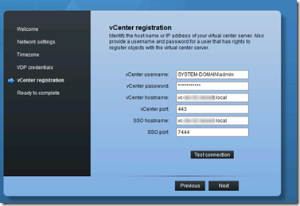
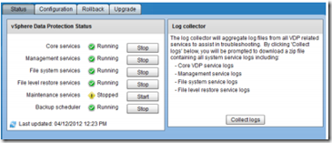

Here are some VDP implementing tips:

- Each vCenter server can support up to 10 VDP appiances
- Each VDP appliance supports up to 100 VMs
- VDP stores deduplicated data on the   0.5,1 or 2 TB datastores.
- It is not possible to use CIFS or NFS shares directly from the VDP appliance.
- VDP comes in 3 different OVA sizes 0,5TB, 1TB and 2TB.  Amount of disk space needed:

<table border="0" cellspacing="0" cellpadding="2" width="400"><tbody><tr><td valign="top" width="200"><strong>OVA Size (TB)</strong></td><td valign="top" width="200"><strong>Disk Space Required (GB)</strong></td></tr><tr><td valign="top" width="200">0,5</td><td valign="top" width="200">850</td></tr><tr><td valign="top" width="200">1</td><td valign="top" width="200">1600 (1,57 TB)</td></tr><tr><td valign="top" width="200">2</td><td valign="top" width="200">3100 (3,02 TB)</td></tr></tbody></table>

- It is not possible to expand the VDP destination datastore
- VDP is managed by the vSphere Web client
- At least one vCenter 5.1 server is required 
- VDP is included in vSphere 5.1 Essentials Plus and higher
- To configure the VDP appliance use the following URL: _**https://ip**_ _**appliance:8543/vdp-configure/**_
- The default username is _**root**_ and the password is **_changeme_**
- For the VDP vCenter registration use formats as in the screenshot:

- After the VDP is configured the following URL can be used to do some configuration and maintenance:  **_https://<ip_** **_address of VDP appliance>:8543/vdp-configure/_**

- VDP supports up to 8 simultaneously backups of 8 VMs

More information on VDP can be found here:

- [vSphere Data Protection Administration Guide](http://pubs.VMware.com/vSphere-51/topic/com.VMware.ICbase/PDF/VMware-data-protection-administration-guide-51.pdf)
-  [VMware Data Protection (VDP) FAQ](http://kb.VMware.com/selfservice/microsites/search.do?language=en_US&cmd=displayKC&externalId=2016565)

