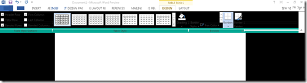
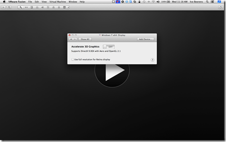

This is because VMware Fusion 5 offers DirectX9 for Windows 7 and Windows 8, but Microsoft Office 2013 requires DirectX10. This is a know issue in VMware Fusion 5.

There are two work arounds available:

- Disable 3D acceleration in the VM settings
- Disable hardware acceleration in the Microsoft Office 2013 application

#### Disable 3D acceleration in the VM settings

- Shut Down the VM
- Go to Settings and click on  Display
- Turn the Accelerate 3D Graphics setting to OFF

- Start the VM

#### Disable hardware acceleration in the Microsoft Office 2013 application

- Open the Office application you want to turn disable the hardware acceleration
- Click on Settings – Advanced – Disable hardware acceleration

More information can be found here.

