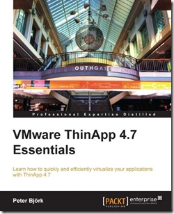

**Book Table of Contents**

> Preface  
> Chapter 1: Application Virtualization  
> Chapter 2: Application Packaging  
> Chapter 3: Deployment of ThinApp Packages  
> Chapter 4: Updating and Tweaking Your ThinApp Project  
> Chapter 5: How to Distribute Updates  
> Chapter 6: Design and Implementation Considerations using ThinApp  
> Chapter 7: Troubleshooting  
> Appendix: References  
> Index

Chapter 1 Application Virtualization is available as **sample chapter**. Link

**About the author**

Peter Björk has many years of ThinApp experience. He started out working with Thinstall, and continued after VMware acquired the product in 2008, renaming it ThinApp. Peter supports ThinApp in the EMEA region. As a teacher, Peter has educated many ThinApp packagers around the world

**Conclusion**

ThinApp 4.7 Essentials is practical book that explains the hole process from building, deploying, updating and tweaking and troubleshooting ThinApp packages. The “ThinApp 4.7 Essentials”  book is a must read for everyone who want or already works with ThinApp and want to extend there knowlegde on it!

**More information**

ThinApp 4.7 Essentials is available as printed copy or as eBook.  More information about “ThinApp 4.7 Essentials” can be found [here](http://www.packtpub.com/VMware-thinapp-4-7-essentials/book)

