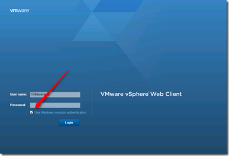

The Client  Integration Plug-in provides:

- Access to the VM console
- Deploy OVF or OVA templates
- Transfer files with the datastore browser
- Use Windows Session authentication

Without the VMware Client Integration Plug-in, the “Use Windows session Authentication” check box is grayed out (1) in the vSphere Web Client login page.

After installing the VMware Client Integration Plug-in (2) from the vSphere Web Client login page, the Use Windows session Authentication check box option can be checked and the current login setting are used in the vSphere Web Client.

