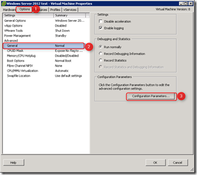
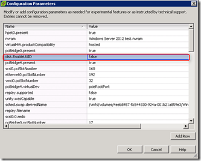

If you don’t disable application-consistent quiescing the backup of the Windows 2008 R2 will probably fail. I experienced this problem by customers who are using VDP and wanted to backup Windows 2008 R2 VMs.

To disable application quiescing use the following steps (This example is based on the vSphere Client but the vSphere Web client can be used to):

- Shut Down the VM
- Edit the settings of the VM, go to the **Options** tab – go to **General** and click on **Configuration** **Parameters** box

- Look if the **disk.EnableUUId** parameter exist. If not Add a new row with this parameter.
- Change the value of the **disk.EnableUUId** parameter to **false**

- Click
- Power On the VM

After changing the **disk.EnableUUId**  parameter to **false** the backup of the Windows 2008 R2 succeeded with VDP. If you have a lot of VMs you can use PowerCLI to automate this process.

